[TOC]


# 起步 #

## 关于版本控制 ##

*定义*

> 版本控制系统（Version Control System，VCS）是一套系统，该系统按时间顺序记录某一个或一系列文件的变更，让你可以查看其以前的特定版本。

*分类及描述*

> 本地版本控制系统：在本地环境，使用简单的数据库来保存文件的所有变更。
>
> 代表：MacOS中的*RCS*工具；
>
> 缺点：*无法进行多人协作*
>
> 集中式版本控制系统（Centralized Version Control System,CVCS）：这类系统具有一个包含文件所有修订版本的单一服务器，多个客户端可以从这个中心位置检出（checkout)文件。
>
> 代表：*CVS*，*Subversion(SVN)*，*Perforce*
>
> 优点：*支持多人协作；权限控制；实现简单*
>
> 缺点：*单点故障影响巨大*
>
> 分布式版本控制系统（Distributed Version Control System，DVCS）：与集中式版本控制系统的区别在于分布式版本控制系统的客户端上不只提取最新版本的文件快照，而是将代码仓库完整地镜像下来。
>
> 代表：*Git*，*Mercurial*，*Bazaar*，*Darcs*
>
> 优点：协作，高可靠性
>
> ***三种版本控制系统的图解***
>
> 1. 本地版本控制系统
>
>    
>
> 2. 集中式版本控制系统
>
>    
>
> 3. 分布式版本控制系统
>
>    

## Git与其他版本控制系统的差异 ##

### 对待数据的方式 ####

Git与其他版本控制系统的主要差异在于：**Git对待数据的方法**

1. 其他版本控制系统（CVS,Subversion,Perforce,Bazaar）

   将它们保存的信息看作是***一组基本文件***和***每个文件随时间逐步累积的差异***。

   存储每个文件与初始版本的差异

   

   除了初次版本中存储的是原始文件外，以后每次版本更新存储的都是差异化文件

2. Git

   Git将数据看作是对小型文件系统的一组快照。

   *定义*：

   | 符号              | 描述                                       |
   | :---------------- | :----------------------------------------- |
   | a，b              | 文件实体a与b                               |
   | &a，&b            | 指向文件实体a与b的链接                     |
   | a^ |文件实体a^|
   | &a^ |文件实体a^的链接|

   version_0中保存了&a,&b

   修改一次a，提交，仓库中产生文件实体a^，产生version_1

   version1中保存了&a^，&b

   如下图所示：

   

   * 初始状态：在仓库中保存a/b，记做version0

     version0中也并非保存具体的文件a与b，而是保存a与b的索引：&a与&b

   * 修改：对a进行修改，记做a1，当前版本记做version1

     version1中保存了a1与b的索引，即：&a1与&b

   * 当前：version0——&a/&b

     ​	version1——&a1/&b

   * 修改：对a进行第二次修改，对b也进行一次修改

     ​	version2——&a2/&b1

### 几乎所有操作都在本地执行 ###

* Git绝大多数操作都只需要访问本地文件和资源，一般不需要来自网络上其他计算机的信息。

### Git保证完整性 ###

* Git使用**校验和**作为索引

* Git使用SHA-1散列（hash，哈希）来计算校验和；由40个十六进制字符组成的字符串。

  ```
  24b9da6552252987aa493b52f8696cd6d3b00373
  ```

* **校验和**是基于**Git中文件的内容或目录结构计算出来的，而不是文件名**

    * blob：文件内容
    * tree：树对象内容（文件名/模式/类型/SHA-1）
    * commit：提交对象的内容（根树对象SHA-1/提交人/mail/提交注释）

### Git一般只添加数据 ###

* 如标题所说，“数据一旦commit到仓库，就不太可能会丢失了”

## Git中，文件的三种状态 ##

* 在Git中，文件可以处于以下三种状态之一

  > 已提交（committed）
  >
  > 已修改（modified）
  >
  > 已暂存（staged）

* 分类概观：

  > ***一个包含.git目录的的目录，我们可以将其看作是一个仓库，我们以下称之为仓库目录***
  >
  > ***仓库目录中包含：git目录，其他文件（要管理的目标文件或目录）***
  >
  > ***仓库目录中的文件，由如下两种状态：***
  >
  > 1. **已跟踪（*tracked*）**：*上一次快照中包含的文件*
  >
  >    *   **已提交(*commited*)**：也可以称为“_未修改_”，与“_已修改_”相对应，表示某个已跟踪的文件目前没有修改，没必要暂存+提交。
  >
  >           别名：未修改
  >
  >    *    **已修改(modified)**：表示某个已跟踪文件已经被修改，待暂存+提交
  >
  >           别名：待暂存
  >
  >    *   *已暂存(*staged*)**：表示某个文件“曾”是已修改状态，并且经过暂存操作，现在待提交
  >
  >           别名：待提交
  >
  > 2. **未跟踪(untracked)**：除去已跟踪文件之外的所有文件，也就是既不在上一次快照中，也不再暂存区中的文件。

* Git工作流程中的三个主要区域

  > 1. ***Git目录（.git directory/Repository）***：即仓库目录下的`.git/`目录，时Git中保存项目元数据和对象数据库的地方。Git中最为重要的部分；Git目录时从其他计算机克隆仓库时所要复制的内容。
  > 2. ***工作目录(Working Directory)***：即仓库目录下除`.git/`目录以外的部分；是项目某个版本的单次***检出（checkout)***；这些文件从Git目录（.git/)下的压缩数据库中提出出来，被放置到仓库目录下以供修改、使用。
  > 3. ***暂存区（Staging Area）***：存储在仓库目录/.git/目录下的一个文件；该文件中保存了下次要提交的内容的相关信息；有时也称作“索引”

* Git的基本工作流：

  > 1. 修改工作目录中的文件
  > 2. ***暂存（stage)***文件：将修改过的文件的快照加入到暂存区
  > 3. ***提交(commit)***暂存区中的文件快照：将修改过的文件的快照永久保存到`.git/`目录
  >
  > 示例说明：
  >
  > 1. 修改了a，当前工作目录中的a变成了a^；b保持不变；
  > 2. 暂存a^：将a^暂存到暂存区中；由于b未修改，仍为b，所以没有被暂存；
  > 3. 提交暂存区中的修改到仓库：将暂存区中的a^提交到Git仓库中，生成一次新的commit对象，称之为version_1；version_1中保存了&a^与&b；最初的version_0中依旧保存&a与&b；
  >
  > 图示：
  >
  > 
  >
  > 图示二：加入未跟踪文件的描述
  >
  > 

## Git命令行 ##

***GUI模式***

***原生的命令行模式***

## 安装Git ##

### 从源代码安装 ###

* 可以获得最新版本的Git

* Git依赖的库：*curl*,*zlib*,*openssl*,*expat*,*libiconv*

  ```
  # 安装依赖库
  $ sudo yum install curl-devel expat-devel gettext-devel openssl-devel zlib-devel
  $ sudo apt-get install libcur14-gnutls-dev libexpat1-dev gettext libz-dev libssl-dev
  ```

  ```
  # 添加更多格式的文档
  $ sudo yum install asciidoc xmlto docbook2x
  $ sudo apt-get install asciidoc xmlto docbook2x
  ```

* 编译并安装

  > 编译并安装
  >
  > ```
  > $ tar -zxf git-2.0.0.tar.gz
  > $ cd git-2.0.0
  > $ make configure
  > $ ./configure --prefix=/usr
  > $ make all doc info
  > $ sudo make install install-doc install-html install-info
  > ```
  >
  > 使用Git获取Git升级：
  >
  > ```
  > git clone git://git.kernel.org/pub/scm/git/git.git
  > ```

## 基本配置 ##

### Git配置文件概述 ###

* `git config`工具配置的变量存储在三个不同的位置：

  > `/etc/giconfig`：对应***--system***选项；包含系统中每一个用户及他们仓库的通用配置；
  >
  > `~/.gitconfig`或`~/.config/git/config`：对应***--global***选项；只针对对应用户；
  >
  > `.git/config`：只针对目标仓库；

* 每一个级别的配置文件覆盖上一级别的配置；

* Windows中：

  > `Git安装目录`：--system选项；全局配置；
  >
  > `$HOME目录即C:\Users\$USER`：--global选项；用户配置；
  >
  > `.git/config`：目标仓库配置

* 使用对应选项进行的配置会写入到对应的配置文件中

### 用户信息 ###

```
# 进行当前用户的git配置
$ git config --global user.name "John Doe"
$ git config --global user.email johndoe@example.com
# 进行全局git配置
$ git config --system user.name "nobody"
$ git config --system user.email nobody@none.com
# 进行仓库配置
# 切换到目标仓库目录下
$ git config user.name "student_0"
$ git config user.email student_0@chd.edu
```

### 文本编辑器 ###

```
$ git config --global core.editor vim
```

### diff工具 ###

```
$ git config --global diff.tool vimdiff
```

### 检查配置信息 ###

```
查看所有system配置：
$ git config --system --list
user.name=nobody
user.email=none@chd.edu
core.editor=vim

查看所有global配置：
$ git config --global --list
user.name=John Doe
user.email=none@chd.edu

查看所有配置：
$ git config --list

检查某一项配置：
$ git config user.name
John Doe
$ git config user.email
johndoe@example.com
```

### 获取帮助 ###

```
$ git help <verb>
$ git <verb> --help
$ man git-<verb>
```

# Git基础 #

## 获取Git仓库 ##

获取Git仓库的两种方法：

* ***从现有目录中初始化Git仓库***

  ```
  $ cd prj/
  $ git init
  或
  $ git init prj
  ```

  * **使用情景**：要开始新的项目，切换到项目所在的根目录，执行`git init`即可在项目根目录中创建`.git/`，即Git仓库；

  * `.git/`目录位于项目目录，项目目录中除`.git/`目录之外是项目的一份`working copy`；

  * `.git/`目录包含了构成Git仓库框架的所有必须文件；此时Git尚未跟踪项目中的任何文件；

  * 初次提交

    ```
    $ git add *.c
    $ git add LICENSE
    $ git commit -m "initial project version"
    ```

* ***克隆已有的仓库***

  ```
  $ git clone [URL] [DIR]
  # 以下命令从[URL]克隆libgit2项目到当前目录下的libgit2目录
  $ git clone https://github.com/libgit2/libgit2
  # 以下命令从[URL]克隆libgit2项目到当前目录下的mylibgit目录
  $ git clone https://github.com/libgit2/libgit2 mylibgit
  ```

  * 是`clone`而不是`checkout`：将libgit2项目的所有数据进行完整复制，而不是像svn一样checkout某一个版本
  * 可用的传输协议：`https://协议`；`git://协议`；`SSH传输协议`

## 在Git仓库中记录变更 ##

* ***当项目到达某个需要记录的状态时向仓库提交这些变更的快照***

    *   不建议过早、过频繁的进行提交
    *   不建议一次性提交多个修改
    *   以上不建议的方式会引起提交记录的混乱

* 文件状态的生命周期

  

### 查看文件状态：`git status` ###

```
$ git status
On branch master
nothing to commit, working directory clean
## 工作目录下没有任何已跟踪的文件被修改过
## 工作目录下没有任何未跟踪的文件
## 当前所处分支；本地分支与服务器上的对应远程分支没有偏离；
```

* **Git不会将工作目录中的未跟踪文件在下一次提交中提交，除非你使用git add明确这样做**

* `git status`的简略形式

  ```
  $ git status --short
  $ git status -s
   M README
  MM Makefile
  A  lib/git.rb
  M  lib/simplegit.rb
  ?? LICENCE.md
  ```

  1. 文件名左侧有两列值
     * **左列有值指的是该文件已被暂存**
     * **右列有值指的是该文件未被暂存**
     * **左右列都有值表示该文件既有被暂存的修改，亦有为暂存的修改**
  2. 各个符号表示的意义
     * **M**：修改
     * **A**：新添加（该值只能存在于左列）
     * **??**：未跟踪文件
  3. 整体说明（下划线表示空格）：
     * `_M README`：README文件已被修改，尚未暂存
     * `MM Makefile`：Makefile之前被修改，且已暂存；暂存后又修改过，后一次修改尚未暂存。
     * `A_ lib/git.rb`：lib/git.rb文件时新添加文件，已被暂存（经过`git add`暂存）
     * `?? LICENCE.md`：LICENCE.md文件尚未跟踪

### 开始跟踪新文件：`git add` ###

* `git add`的两个作用
  1. **开始跟踪新文件**（本小节）
  2. **将修改添加到暂存区**（下一小节）
* `git add`命令接收一个文件或目录的路径名作为参数
* **`git add`的参数为目录，则会递归地将目录下的所有文件add到暂存区中**

### 暂存已修改的文件 ###

* `git add`
  * 上一小节中提到的**将修改添加到暂存区**或者说**创建新blob对象并暂存**功能
* `git add`的是当前文件，执行`git add`操作之后再对文件进行的修改，必须再次执行`git add`才可以将其暂存到暂存区；

### 忽略文件：`.gitignore` ###

* `.gitignore`文件中与模式匹配的文件将会被git自动排除在跟踪列之外，且不会显示在“未跟踪”列表中。

* 匹配规则

  > * **空行**或者**以#开始的行**会被忽略
  > * 支持**标准glob模式**（通配符）
  >   * "*"表示匹配零个或多个字符
  >   * “[abc]”匹配方括号内的任意一个字符
  >   * “?"匹配任意单个字符
  >   * "[0-9]"匹配0到9范围内的任何一个单个字符
  >   * "a/**/z"匹配嵌套目录如：a/z a/b/z a/b/c/z
  > * 以**斜杠（/）**开头的模式可用于禁止递归匹配
  > * 以**斜杠（/）**结尾的模式表示目录
  > * 以**感叹号（!）**开始的模式表示取反

* `.gitignore`示例

  > *.a			# 忽略.a类型的文件
  >
  > !lib.a		# 忽略上述规则，仍然跟踪lib.a
  >
  > /TODO		# 忽略当前目录下的TODO文件，禁止递归
  >
  > build/		# 忽略build/目录下的所有文件
  >
  > doc/*.txt	# 忽略doc/目录下的txt文件，不忽略doc/xxx/.txt文件
  >
  > doc/**/*.pdf	# 忽略doc/目录下的所有pdf文件，包括更深层目录中的pdf文件

### 查看已暂存和已修改的变更：`git diff` ###

* `git diff`命令

  ```
  $ git diff				# 查看尚未暂存的，工作区与git仓库中最新blob内容的patch
  $ git diff --staged		# 查看已暂存的blob对象 与 git仓库中已提交的blob对象的patch
  $ git diff --cached		# 同--staged
  ```

* `git diff`显示的是：工作区中的修改；如果一个文件之前暂存过一次修改，那么显示的是工作区与暂存区的差别

* `git diff --staged`显示的是：已暂存的文件的修改，当前暂存区中文件与已提交的文件的差别。

* 示例：

  ```
  # file(main.c) content commited
  first init.
  
  # file(main.c) modified and staged
  first init.
  second modified.
  
  # file(main.c) modified again but has not been staged
  first init.
  second modified.
  third modified.
  
  说明：
  1. 此时，main.c已commited的内容为：
  	"first init."
  2. main.c已staged的内容为：
  	“first init.
  	second modified."
  3. main.c当前工作目录中未暂存的内容为：
  	“first init.
  	second modified.
  	third modified."
  
  结果：
  git diff显示的是：
  3与2的差别即+third modified.
  
  git diff --staged显示的是：
  2与1的差别即：+second modified
  ```

### 提交变更：`git commit` ###

* `git commit`

  ```
  $ git commit
  # 命令执行后，打开预先配置好的文本编辑器
  # 编辑器中以“#”开头的部分为提示信息（git status的内容），保存退出后不会作为提交提示信息
  $ git commit -v
  # 添加-v选项后，编辑器中会显示除git status提示信息以外，还会显示git diff --staged显示的内容，即本次提交的修改的具体内容
  ```

* `git commit -m`

  ```
  $ git commit -m "commit infomation input"
  # 直接将-m后的字符串作为提交信息
  ```

* `git commit -a`

  ```
  $ git commit -a -m "user input"
  # 跳过暂存区直接提交
  ################################
  # 所有已跟踪文件的修改都会被直接提交
  # 未跟踪文件不会被通过这种方式提交
  # 执行该命令时，已在暂存区中的修改也会被提交
  # 对于未跟踪的文件：除非显式的使用git add，否则不会自动跟踪
  ################################
  ```

* 提交后的显示

  ```
  $ git commit -m "main.c modified."
  [master 463dc4f] main.c modified.
  2 files changed, 2 insertions(+)
  create mode 100644 main.c
  # "main.c modified"为提交时输入的提交信息
  # 还会显示“本次提交”的SHA-1校验和（463dc4f)
  # 显示提交到了哪一个分支
  ```

### 移除文件 ###

* *要从Git中移除某个文件，你需要把它先从已跟踪文件列表中移除（确切地说，是从暂存区中移除），然后再提交。*

  **解析**：这里的**“从已跟踪列表中移除”**与**“从暂存区中移除”**指的是**将“删除”操作提交到暂存区**或者称为：**暂存“删除”操作**

* `git rm`的副作用

  将`working copy`中的对应文件删除，是`git rm`命令的副作用

  `git rm`本身的作用仅是让git不再跟踪某文件，当然，也可以通过`git rm --cached`来消除这一副作用，不删除`working copy`中文件。

* 类比`git add`操作流程

  修改文件——`git add filename`——`git commit`

  新增文件——`git add newfile`——`git commit`

  删除文件——`git rm filename`——`git commit`

  可以直接跳过删除文件这一步操作，直接使用`git rm filename`并使用`git commit`

* 异常分析

  > 环境：windows 7 git version 2.8.1
  >
  > `hello.c`为已跟踪文件
  >
  > 对`hello.c`修改并暂存
  >
  > 进行以下操作：
  >
  > 1. `rm hello.c`
  >
  >    状态显示为：_D hello.c
  >
  >    说明：原先的M操作被后来的D操作覆盖
  >
  > 2. `git rm hello.c`
  >
  >    操作失败，暂存区中的内容尚未跟踪，如果允许删除的话将会丢失内容
  >
  > 3. `git rm -f hello.c`
  >
  >    强制删除，执行成功，状态显示为：D_ hello.c
  >
  >    说明：强制删除操作已暂存，待提交

* `git rm --cached`

  仅取消跟踪，但不删除`working copy`中的文件

  取消了副作用的`git rm`操作

* `git rm`可以使用通配符

### 移动文件 ###

* 重命名文件后，`git`记录了什么？

  > 在Linux中，`git`会将状态记录为：_R hello.c即未提交的重命名，并记录重命名前后的文件名
  >
  > 在windows中，`git`会将状态记录为：_D src.c   ?? new.c，也就是表示删除源文件，新增新文件；
  >
  > 可能是由于测试所用git版本的问题导致的

* `git mv src.c new.c`命令

  > 将src.c文件重命名为new.c并将该操作`add`到暂存区，等待commit
  >
  > 相当于执行了以下命令：
  >
  > `mv src.c new.c`
  >
  > ​	`_D src.c`
  >
  > ​	`?? new.c`
  >
  > `git rm src.c`
  >
  > `git add new.c`
  >
  > 当前的状态：
  >
  > R_ sr.c -> new.c（***也就是说，git识别到了这次重命名，即使我们分多步进行操作！！！***）

## 查看提交历史 ##

* `git log`

  > 按时间顺序列出仓库中的所有提交
  > 最新的提交在最前面
  > 每个提交包含一些信息：**SHA-1校验和**、**作者姓名与邮箱**、**提交日期**以及**提交信息**

* `git log -p`

  > 另外显示出每次提交所引入的差异

* `git log -n`

  > 仅显示最近n次提交信息

* `git log --stat`

  > 显示每个提交的简要统计信息
  >
  > 显示如下内容：**改动的文件列表**、**共有多少文件被改动**、**文件里有多少新增行和删除行**、**汇总信息**

* `git log --pretty=xxx`

  > --pretty后的选项可以是：oneline/full/fuller/format
  >
  > * oneline/full/fuller依次显示更多的内容
  > * format允许自由控制输出内容

* `git log --pretty=format:"%h - %an, %ar : %s"`

  > 格式选项：
  >
  > | 格式选项 | 输出的格式描述                           |
  > | -------- | ---------------------------------------- |
  > | %H       | 提交对象的散列值                         |
  > | %h       | 提交对象的散列值的简短值                 |
  > | %T       | 树对象的散列值                           |
  > | %t       | 树对象的散列值的简短值                   |
  > | %P       | 父对象的散列值                           |
  > | %p       | 父对象的散列值的简短值                   |
  > | %an      | 作者姓名                                 |
  > | %ae      | 作者邮箱                                 |
  > | %ad      | 创建日期（可使用-date=选项指定日期格式） |
  > | %ar      | 相对于当前日期的创建日期                 |
  > | %cn      | 提交者的名字                             |
  > | %ce      | 提交者的电子邮箱地址                     |
  > | %cd      | 提交日期                                 |
  > | %cr      | 相对于当前日期的提交日期                 |
  > | %s       | 提交信息的主题                           |

* `git log --graph`

  > `--graph`选项会用ASCII字符形式的简单图表来显示Git分支和合并历史

* `git log --decorate`

  > 显示分支信息，HEAD指针的位置（当前所处分支）

* `git log`常用选项汇总

  | 选项                | 描述                                                     |
  | ------------------- | -------------------------------------------------------- |
  | -p                  | 按一定格式显示每次提交引入的修改                         |
  | --stat              | 显示每个提交被更改的文件的统计信息                       |
  | **--shortstat**     | **只显示--stat输出中包含“已更改/新增/删除”行的统计信息** |
  | **--name-only**     | **显示被更改的文件列表**                                 |
  | **--name-status**   | **在上一个选项基础上显示“已更改/新增/删除”统计信息**     |
  | **--abbrev-commit** | **只显示完整的SHA-1 40为校验码中的前几个字符**           |
  | **--relative-date** | **显示相对日期而不是完整日期**                           |
  | --graph             | 以ASCII图表形式显示                                      |
  | --pretty            | 更换格式，oneline/short/full/fuller/format               |

* **过滤提交历史以显示**

  * 汇总

    | 选项                 | 描述                                       |
    | -------------------- | ------------------------------------------ |
    | `-(n)`               | 只显示最新n次提交                          |
    | `--since`/`--after`  | 输出指定日期时间之后的提交                 |
    | `--until`/`--before` | 输出指定日期时间之前的提交                 |
    | `--author`           | 输出*作者*与指定字符串匹配的提交           |
    | `--committer`        | 输出*提交者*与指定字符串匹配的提交         |
    | `--grep`             | 输出*提交信息*与指定字符串匹配的提交       |
    | `-S`                 | 输出包含“添加或删除指定字符串”的更改的提交 |
    | `-- filename`        | 输出指定文件名或路径相关的提交             |

  * 示例

    ```
    $ git log --since=2.weeks # 输出两周以内的提交
    $ git log --after=3.years # 输出3年以内的提交
    $ git log --since="2 years 1 day 3 minutes" # 输出2年1天3分钟以内的提交
    $ git log --until="10 years" # 输出10年以前的提交
    $ git log --author=Scott # 输出作者字符串中包含"Scott"的提交
    $ git log --author="Scott Chacon" # 输出作者字符串包含“Scott Chacon"的提交
    $ git log --committer="shit" # 输出提交者中包含”shit“的提交
    $ git log --grep="[1-10]. # 输出提交信息与正则表达式匹配的提交
    $ git log --Sshow_print # 输出“添加或删除字符串”与show_print匹配的提交
    $ git log -- Rakefile # 输出对Rakefile文件相关操作的提交
    $ git log -- lib/ # 输出对lib/目录相关操作的提交
    
    # 在Git项目历史中查看作者为gitster，从2008-08-01到2008-11-01这段时间内提交的t/目录下的没有被合并的提交
    $ git log --pretty="%h - %s" --author=gitster --since="2008-08-01" \
      --before="2008-11-01" --no-merges -- t/
    ```

## 撤销操作 ##

### 修改提交信息 ###

* `git commit --amend`

* 两个功能：

  1. 上一次提交后，未进行任何动作：允许你重新修改**提交信息**
  2. 上一次提交后，向暂存区添加了新的修改：允许你将当前暂存区中的修改合并到上一次提交中——风险：不要对已push的提交做`--amend`操作，会该操作会修改commit

* 示例：

  ```
  # 功能一：
  $ git commit -m "git init"
  $ git commit -amend
  # 打开“提交信息”编辑，重新编辑后保存即可修改上一次提交的“提交信息”
  
  # 功能二：
  $ git commit -m "git init"
  $ git add forgotten_file
  $ git commit --amend
  # 打开“提交信息”编辑，重新编辑后保存；最近一次add的文件修改也会被合并到上一次提交，并允许你修改一次“提交信息”
  ```

### 撤销已暂存的文件 ###

* 将已暂存的修改撤销“add"操作，恢复到***已修改（未提交）***的状态

* `git reset HEAD <file>`

  ```
  $ git add file.c
  $ git reset HEAD file.c
  # 即可将已添加进暂存区中的修改撤销，但不会修改working copy中的内容
  ```

### 撤销对文件的修改 ###

* 对`working copy`中的某个文件修改后，尚未提交；此时如果想要撤销这些尚未暂存的修改。

* `git checkout -- file.c`

  ```
  $ git checkout -- file.c
  # 将file.c的当前最新版本“检出”，即可撤销我们对file.c的修改
  ```

* 这里文件名前添加”--“并且，两个横杠两边各有一个空格，用来说明后面是一个文件名，防止git误判，将同名分支检出

## 远程仓库的使用 ##

*   已移动到下一章节

## 标记 ##

* **将某个特定的历史版本标记为重要版本的方法**

### 列举标签 ###

* `git tag`
  * 按字典序列出所有标签，顺序与标签创建顺序、重要性无关
  * 可以按照匹配模式搜索标签，如：`git tag -l "v1.8.5*"`
* `git tag -l "pattern"`
  * 列出符合模式的tag

### 显示标签的详细信息 ###

* `git show tag_name`

* 示例：

  ```
  $ git show v1.4
  $ git show v1.0
  tag v1.0										# 标签名
  Tagger: zz <terroristzheng@qq.com>				# 打标签者及邮箱
  Date:   Sun Sep 9 15:36:33 2018 +0800			# 标签创建时间
  
  first tag haha!									# 标签创建信息
  
  commit ca82a6dff817ec66f44342007202690a93763949	# 打标签时的分支的commit信息
  Author: Scott Chacon <schacon@gmail.com>
  Date:   Mon Mar 17 21:52:11 2008 -0700
  
      changed the verison number
  
  diff --git a/Rakefile b/Rakefile
  index a874b73..8f94139 100644
  --- a/Rakefile
  +++ b/Rakefile
  @@ -5,7 +5,7 @@ require 'rake/gempackagetask'
   spec = Gem::Specification.new do |s|
       s.platform  =   Gem::Platform::RUBY
       s.name      =   "simplegit"
  -    s.version   =   "0.1.0"
  +    s.version   =   "0.1.1"
       s.author    =   "Scott Chacon"
       s.email     =   "schacon@gmail.com"
       s.summary   =   "A simple gem for using Git in Ruby code."
  ```

### 标签分类 ###

* **轻量标签（`light-weight tag`）**：
  * 更像一个不变的分支，是一个指向某次提交的指针
* **注释标签（`annotated tag`）**：
  * 作为完整的对象存储在`git数据库`中
  * git会计算其**校验和**，包含**标记者（tagger）的名字**、**邮箱地址**、**标签的创建时间**、**标记消息**
  * 还可以使用`GNU Privacy Guard（GPG）`对标签进行签名和验证

### 创建注释标签 ###

* `git tag -a tag_name`

* 示例：

  ```
  $ git tag -a v1.4 -m "release version 1.4"
  $ git tag
  v1.4
  ```

### 创建轻量标签 ###

* `git tag tag_name`
  * 使用`git show tag_name`显示注释标签信息时，只会显示对应的提交信息

### 补加标签 ###

* 对之前的某个commit打标签
* `git tag -a tag_name <对应提交的校验和>`

### 共享标签 ###

* `git push`命令默认不会将本地仓库中的标签上传到服务器上
* `git push  origin [tag_name]`
  * 将tag_name推送到远程origin服务器中
* `git push origin --tags`
  * 将本地所有tag推送到远程origin服务器中

### 检出标签 ###

* 标签无法检出，可以通过在该标签上创建分支，并检出分支的方法，间接检出标签

* `git branch -b [branch_name][tagname]`

  ```
  $ git checkout -b tag_branch v1.0
  Switched to a new branch 'tag_branch'
  ```

## Git别名 ##

* 可以通过`git config --global alias.xx xxxxx`来创建xxxxx的别名xx

* 示例：

  ```
  $ git config --global alias.co checkout
  $ git config --global alias.ci commit
  $ git config --global alias.br branch
  $ git config --global alias.si status
  $ git config --global alias.unstage 'reset HEAD -- '
  $ git config --global alias.last 'log -1 HEAD'
  ```

* 外部命令别名

  * 给外部命令添加"!"即可

  * 示例：

    ```
    $ git config --global alias.visual '!gitk'
    gitk为你编写的一个git外部工具
    以后就可以使用git visual来直接调用该工具了！！！
    ```

# Git分支 #

*   Git分支模型：Git的杀手级特征

*   ***分支意味着偏离开发主线并继续你自己的工作而不影响主线开发***

    Git鼓励在工作流中频繁使用分支与合并操作

## 分支机制简述 ##

### Git是如何存储数据的 ###

* 采用**快照**的方式，而不是**存储差异**的方式

* **提交对象（`commit object`）**：发起提交时，Git存储的是提交对象

  * 即将创建的提交对象中包含**指向暂存区中快照的指针**；
  * 当`add`操作将文件添加到暂存区中时，实际上是将当前`working copy`中的对应文件的一份压缩版本放到了暂存区中——***使用对应文件创建blob对象，并在暂存区中记录其相关信息***
  * 提交信息中包含：作者姓名、邮箱、已输入的提交信息、指向父提交的指针；

* **父提交**：初始提交没有父提交；一般一个提交对象有一个父提交或者多个父提交；

* **blob对象**：每个文件的每一次修改都会生成一个新的blob对象记录文件的全部内容（***而非差异***）

  * blob对象保存在`.git/object/`目录下；目录名为该blob对象SHA-1校验和的前两位，目录下的（压缩）文件名为该blob对象SHA-1校验和的后续38位；——`.git/object/`目录下存储所有对象（blob/tree/commit/tag对象）

* **树对象**：类似于Linux文件系统实现，目录中保存文件名与对应blob对象的对应关系；

  * blob对象用校验和来标记(就像一个指针)

  * 树对象的校验和是如何计算的呢？

      >   树对象中内容的一般格式：
      >
      >   λ git cat-file -p bae78c
      >   100644 blob fb0a03d992212388b6835ab96fe4affa483a100b    shit
      >   100644 blob c06d81c1f5220c3d4ac9aff03f6b9b91f0edeefc    shit2
      >
      >   模式	类型	SHA-1	文件名
      >
      >   校验和即是通过树对象中的内容进行计算的

  * 每次提交一定会生成新的树对象吗？

      >   *   每次提交（有效提交，暂存区中存在修改）至少生成一个树对象（至少生成***根树对象***）
      >
      >   *   如果暂存的某个blob对象在目录kick/下，则提交时会生成两个新树对象：kick以及根树对象
      >
      >       因为blob对象发生了变化（SHA-1变化），那相应的树对象kick（存储了目录下的文件名-SHA-1映射）也需要发生变化，进而，导致根树对象（存储了kick/目录名-树对象SHA-1）发生变化，所以会生成两个新树对象
      >
      >       根据上一个问题中树对象中存储的内容来看，只要该树对象下的文件发生变化，就必须重新创建树对象了
      >
      >   *   另外，树对象的创建都是在（目前已知）提交时创建的

* 每次提交后，生成新的提交对象中有一个指向**根树对象**的指针

* **分支的实质**：

  * `.git/refs/heads/`

    > 该目录下即保存着每个分支的文件，文件中记录了对应提交的SHA-1校验和

  * `.git/refs/tags/`

    > 该目录下即保存着每个标签的文件，文件中记录了对应提交的SHA-1校验和

  * HEAD

    > `.git/HEAD`文件的内容为对应branch的路径
    >
    > 假设，当前在iss53分支，则`.git/HEAD`中的内容为：
    >
    > `ref: refs/heads/iss53`

* 一次操作流程：

  * 每次`git add`操作会新增一个blob（有时候如果一个文件已经被add过一次，则不会新增）保存在`.git/object`目录下

  * 每次进行提交时：git为每个子目录计算校验和；再为根目录计算校验和；把这些树对象也保存到`.git/object`目录下
  * 提交时，创建一个新的**提交对象**，提交对象中有一些元数据（记录提交信息）与一个指向根tree对象的指针；还有指向上一次提交的指针（也就是上一次提交的SHA-1校验和）；
  * 多次提交就会形成一个***链***；

* 图示：

  * 一次提交所有相关的对象

    

  * 多次提交形成的链

    

* 分支是怎么回事？

  * **git分支事实上就是指向某次提交的指针**

  * master是git默认创建的分支指针——`refs/heads/branch_name`中存储的时提交的SHA-1值

  * 创建分支时，所创建的分支指向当前所在的commit对象；对该分支进行多次修改后，会形成一条与master分支不同的`commit链`；就像是在原先的master链上开了个岔路口；即为分支；

  * 图示：

    

    图中表示的是，创建v1.0分支之初，v1.0分支与master分支一样，都指向同一次提交；

* ***要理解的是，不管我们是否创建分支，不管是不是有master分支；commit链都会随着提交而增长，分支仅仅是指向这条链上某一个节点的指针而已罢了。***

* ***我们如何在多条分支中来回切换而不眼花呢？Git使用HEAD指针指向当前你所在的分支！！！***

### 创建新分支 ###

* 实质：“*当你创建新分支时，Git会创建一个可移动的新指针供你使用*”

* **HEAD指针**：在Git中HEAD是一个指向当前所在的本地分支的指针

  * HEAD指针指向的位置变化，（可能）会影响`working copy`中的内容:)，仔细思考下吧

* `git branch bra_name`

  ```
  $ git branch testing
  # 在当前HEAD指向的commit对象上创建一个testing分支
  # 当前HEAD指针不变:)
  ```

* `git chekcout -b bra_name`

  ```
  $ git checkout -b testing
  # 创建并切换到分支testing
  ```

* `git log --decorate`

  - 显示log信息时，显示分支信息（有哪些分支指向了哪些commit对象，当前HEAD分支指向了哪里即当前所处分支）

### 切换分支 ###

* 切换分支的真正含义：
  * HEAD指针指向要切换的分支所指向的提交对象
  
  * 将目标提交对象对应的所有内容检出到`working copy`
  
      `checkout`的意义就呼之欲出了:)
* `git checkout testing`
* 切换分支失败的情形：
  * 切换分支时，当前分支上有未添加到暂存区的修改——未添加到暂存区可能面临丢失的风险
  
      >   2019/11/22 git version 2.24.0.windows.2/ git version 2.17.1.linux
      >
      >   *   当test分支包含未暂存的修改时，切换分支到master，git会保留working copy中的修改（即使冲突）——就相当于在master上进行了修改，但未暂存
      >   *   当test分支包含已暂存的修改时（未提交），切换分支到master，表现与上述一致——就相当于在master上进行了修改并暂存（尚未提交）
  
  * （切换分支时，暂存区中有与切换到的目标分支上的内容冲突——20190428暂存区中的内容必须commit，否则也无法切换分支）——存疑，可能存在其他特殊情况
* 如何避免失败？
  * 在切换分支时，保证clean
  * 储藏、修订提交

## 基本的分支与合并操作 ##

* 流程阐述

  *   为某一“网站项目”工作，主线分支
  
  *   为新需求创建分支

  *   在新分支上开展工作

  此时，接到网站严重bug的紧急修复任务，随后的操作：
  
  *   切换到主线分支
  
  *   创建新的分支以修复问题
  
  *   通过测试后，将紧急bug修复分支推送到主线分支上
  
  *   切换到之前的需求开发分支

### 基本的分支操作 ###

```
$ git checkout -b req53
    $ git branch req53
    $ git checkout req53
$ 在分支req53上进行需求req53的开发工作
接到修复bug任务
$ git commit -a -m "提交req53已完成的工作“
$ git checkout master
$ git checkout -b hot-fix66
修复bug并提交、验证无误后
$ git checkout master
$ git merge hot-fix66  # 将hot-fix66分支与当前分支(master)合并
$ git branch -d hot-fix66 # 删除无用的hot-fix66分支

$ git checkout req53
继续进行工作
```

* `fast-forward`：直接通过移动分支指针即可完成合并操作，不会产生新的提交的合并操作
* 切换分支前请保证，当前`working copy`中不存在未提交的修改；保证暂存区中没有没有与要切换到的分支冲突的修改；
* `git merge bra`的方向：将分支bra与当前所在分支合并:)

### 基本的合并操作 ###

* **三方合并**

  > 概念：三方合并操作会使用两个待合并分支上最新提交的结果，以及这两个分支的共同祖先的提交快照；并基于三方合并的结果创建新的快照，然后创建一个新的提交指向新的快照；
  >
  > 哪三方：
  >
  > 1. 共同祖先
  > 2. 并入的分支（入）
  > 3. 要合并的分支（出）

* 所谓**合并**

  * 合并，是真的合并吗？

    所谓的合并(`merge`)事实上并非“合并”；而是将**一个分支**基于**共同祖先**的修改合并到另一个分支上；

    合并的结果是：***当前所在分支向前移动一个提交；被并入的分支保持不变！！！***

    	移动的该提交即为一个新的提交，该提交有两个父提交

### 基本的合并冲突处理 ###

* `git merge`冲突后的输出：

  ```
  $ git merge iss53
  Auto-merging index.html
  CONFLICT (content): Merge conflict in index.html
  Automatic merge failed; fix conflicts and then commit the result.
  ```

  描述：

  * `merge`冲突后，`Git`不会自动创建合并提交，而是暂停整个合并过程，等待你解决。

  * `merge`冲突状态下，并不会像SVN一样自动打开冲突解决工具，创建冲突文件；而是直接标记冲突文件中的冲突位置，我们可以就像进行一次修改一样，自行修改冲突的位置，然后提交，完成合并流程

* 冲突的解决

   * `git status`显示的冲突文件

     ```
     $ git status
       On branch Master
       You have unmerged paths.
        (fix conflicts and run "git commit")
       Unmerged paths:
          (use "git add <file>..." to mark resolution)
            both modified: index.html
       no changeds added to commit (user "git add" and/or "git commit -a")
     # 以上标记了冲突的文件，我们需要对冲突文件的冲突位置进行修改
     # 注意（use "git add <file>..." to mark resolution）说明，一旦我们使用"git add"命令就说明我们已经将冲突标记为“resolution"状态
     ```

   * 文件中冲突的形式

     ```
     <<<<<<< HEAD:index.html
     <div id="footer">contact : email.support@github.com</div>
     =
     <div id="footer">
      please contact us at support@github.com
     </div>
     >>>>>>> iss53:index.html
     # 上半部分：当前分支的文件冲突部位的内容————并入的目标分支
     # 下半部分：分支iss53分支的文件冲突部位的内容————要合并的分支
     
     # 可以将“合并”看做是：将iss53的修改在HEAD（当前分支）重现（但并非重现）
     ```
* ***在解决了每个冲突文件的所有冲突部分后，就可以执行`git add`来把每个文件标记为冲突已解决状态。在Git中，这可以通过把文件添加到暂存区来实现***

* 合并工具

  ```
  $ git config core.mergetool vimdiff
  可供选择的合并工具有：
  opendiff/kdiff3/tkdiff/xxdiff/meld/tortoisemerge/gvimdiff/diffuse/diffmerge...
  ```

## 分支管理 ##

* 分支创建：`git branch xxx`

* 分支创建并切换到：`git checkout -b xxx`

* 分支合并：`git merge xxx`

* 分支检出：`git checkout xxx`

* 分支删除：`git branch -d xxx`

* 分支列举：`git branch`

  > 分支列举结果中，前面加*号的表示当前分支

  * 分支详细列举：`git branch -v`

  * 已合并分支列举：`git branch --merged`

    > 已合入到当前分支的分支
    >
    > 如果当前分支是master，那么这种已合入主线的分支一般就可以直接删除了:P

  * 未合并分支列举：`git branch --no-merged`

    > 未合入当前分支的分支
    >
    > 如果当前分支是master，那么未合入主线的分支不要轻易删除——可能丢失修改，git会拒绝删除
    >
    > *   可以通过`-D`选项强制删除：`git branch -D xxx`

## 与分支有关的工作流 ##

* 可以借鉴的`Git`的常用工作流程

### 长期分支 ###

* 简述：**拥有稳定的（这里的稳定不是指代码稳定）、长期的一条`commit`链；稳定的`master`分支位于链的后端，功能、代码稳定的位置；不稳定的测试版本、新需求版本指向链的较前端；**

  **尤其适用于大型、复杂项目**

* 从上可以看出，一般可以使用`fast-forward`来进行合并

* **工作筒仓（work silo）**：不同稳定程度的分支可以被看做是不同的筒仓；随着代码的稳定性提高，不断地将较新的筒仓加入到稳定的筒仓中去（分支）

* 稳定性渐进变化的不同分支的线性视图

  

* 稳定性渐进变化的不同分支的“筒仓”视图

  

* 图示描述：

  > 稳定级别由高到低为：master > develop > topic
  >
  > 一旦develop分支功能达到足够稳定的级别，就可以移动master分支指针到develop；
  >
  > 一旦topic分支功能开发完成，就可以将topic分支合并到develop（即移动develop分支到topic）
  >
  > 上面分别是**长期分支**工作流的**线性视图**与**筒仓视图**

* proposed（提议）与pu（proposed updates，提议的更新）也常被用作不同稳定性的分支的名称

### 主题分支 ###

* 概述：**短期的、用于实现某一特定功能及其相关工作的分支**

  适用于任何规模的项目

* 优势：

  * 快速完成完整的上下文切换
  * 不同的工作分布于不同的分支（筒仓）中，便于代码审查
  * 不需要关注多个并行分支的先后顺序

* 示例：

  

  * `iss91`/`iss91v2`/`dumbidea`是三条主题分支；`master`为主线分支
  * 三条主题分支开始于不同的时间；可以认为`dumbidea`为最新的主题分支

  

  * 我们选择抛弃`iss91`分支的实现；
  * 先将`dumbidea`分支直接`fast-forward`合并到`master`上；
  * 再将`iss91v2`通过三方合并，合并到`master`上；产生了新的**提交**（c14）

* 以上不管是长期分支还是主题分支都是***本地分支***

## 远程仓库的使用 ##

-   ***有些概念，诸如：远程分支、push、fetch等，理解后将有助于我们理解整个工作流程***

-   **远程分支**：已跟踪的远程仓库中的分支；远程分支随着`git fetch`命令而变化；

    >   不会随我们手动键入命令而改变，相当于远程仓库中的分支位于本地的映像；

-   **远程仓库**：“托管在因特网或其他网络中的你的项目的版本库”

    >   一个本地仓库可以关联多个远程仓库；远程服务器上的一个目录，已被git跟踪初始化；
    >
    >   管理远程仓库：
    >
    >   1.  添加远程仓库
    >   2.  移除无效的远程仓库
    >   3.  管理不同的远程分支并定义它们是否被跟踪
    >   4.  远程仓库常被用于多人协作
    >   5.  一个本地仓库可以添加多个远程仓库（可以是多个无关仓库，但是目前看来没什么意义）

-   **上游分支**：已关联远程分支的本地分支；

-   **push**：将已关联的本地分支的内容推送到远程分支上

    >   推送的对象是”本地分支”——事实上是将本地分支在远程仓库中与远程分支进行`merge`操作
    >
    >   如果git push的分支没有关联的远程分支，则在远程仓库中新建同名分支，并在本地创建对应的远程分支（仍不会主动关联）
    >
    
-   **fetch**：将git仓库中所有本地仓库中缺少的内容获取下来，更新分支（远程分支）等操作

-   **pull**：将git仓库中所有本地仓库中缺少的内容获取下来，并尝试合并到已关联的本地分支

### 查看远程仓库 ###

-   `origin`：一个默认的远程仓库；这是本地git给克隆服务器取的默认名称；
-   `git remote`：显示git存储的所有远程仓库
-   `git remote -v`：另外显示远程仓库的地址，以及*push*、*fetch*路径
-   **在本地，每个本地存储的远程仓库都会对应两个路径：**
    -   `push`路径
    -   `fetch`路径

### 检查远程仓库 ###

```
$ git remote show origin
* remote origin
  Fetch URL: https://github.com/schacon/simplegit-progit
  Push  URL: https://github.com/schacon/simplegit-progit
  HEAD branch: master						# 本地当前所处的分支
  Remote branch:							# 远程分支有哪些
    master tracked
    dev-branch tracked						# 已跟踪的分支
    issue-43 new(next fetch will store in remotes/origin)	# 远程仓库新增的分支
    refs/remotes/origin/issue-11 stale (use 'git remote prune' to
remove)										# 已被远程仓库移除的分支
  Local branch configured for 'git pull':   # 已关联用于pull的分支
    master merges with remote master
    dev-branch merges with remote dev-branch	# origin/dev-branch对应远程分支dev-branch
  Local ref configured for 'git push':		# 已关联用于push的分支
    master pushes to master (up to date)
# 上述信息会告诉我们：
# 1. 远程仓库origin中包含了哪些分支（有哪些远程分支）
# 2. 远程仓库origin中的哪些分支已与本地分支关联
# 3. 当执行git push时，哪些本地分支会推送到哪些远程分支上
# 4. 当执行git pull时，哪些远程分支会被拉取到本地并与哪些本地分支合并
```

### 添加远程仓库 ###

-   **克隆仓库`git clone`**：与添加远程仓库不同

    -   克隆仓库会在当前目录新建一个目录作为远程克隆仓库的工作目录，并记录远程仓库中的所有信息

    -   **添加远程仓库**只是将当前目录**已有仓库**与远程仓库关联起来，不会检出最新版本

    -   一个本地仓库可以与多个**远程仓库**关联起来

        也就是说，一个本地仓库可以**添加多个远程仓库**，每个远程仓库不必相关。

    -   **克隆仓库**会在本地创建远程对应的本地仓库，并创建本地master分支，将本地master与远程master分支关联（默认只关联master）

-   **添加远程仓库**：将本地仓库与远程服务器上的一个仓库**关联**起来；

    -   本地必须已经存在一个仓库（是否为空无所谓）
    -   使用命令`git remote add [shortname][url]`
    -   **一个本地仓库可以添加多个远程仓库，并且这些远程仓库有没有关系都无所谓**

-   对于每一个与本地关联了的**远程仓库**，都相当于一个独立的仓库，至少拥有一个`master`分支

    -   可以通过`pb/master`来访问该分支

### 从远程仓库获取和拉取数据 ###

-   `git fetch`与`git pull`的区别与关系
    -   `git fetch`将远程仓库中的数据拉取到本地，并更新本地存储的远程仓库的数据
    -   `git pull`在本地某个分支与远程仓库的分支关联的情况下（克隆仓库会执行默认关联master），将远程分支中更新的内容拉取到本地并尝试与本地分支合并

### 将数据推送到远程仓库 ###

-   向远程仓库推送数据的基本单元是：**分支**
    -   所以描述为：将本地某个分支推送到某个远程仓库，并与远程仓库中的关联分支合并
    -   `git push origh master`
-   推送的前提：
    -   拥有origin远程仓库的写权限
    -   上一次fetch后并合并后（或者上一次`git pull`后）没有人向该远程仓库中推送过数据

### 删除和重命名远程仓库 ###

-   `git rename rename pb paul`
    -   重命名远程仓库
    -   是否可以重命名本地分支呢？并且使得该分支跟随的远程分支不变？
-   `git remote rm paul`
    -   删除远程仓库
    -   服务器地址变更时，参与者退出协作时

## 远程分支 ##

### 信息汇总 ###

* **远程引用**

  * 对远程仓库的引用（指针），包括分支/标签等。

* **远程分支**：指向远程仓库的分支的指针，这些指针存在于本地且**无法移动**

  * 远程分支（指针）无法直接移动，但是会在与服务器远程通信时自动更新

    像书签一样，提示你上一次连接服务器时远程仓库中每个分支的位置

  * 引用方法：`(remote)/(branch)`

* 示例：

  * 远程服务器地址为：`git.ourcompany.com`

    > 远程服务器上可以有多个仓库

  * 克隆远程服务器上的仓库`project.git`

    > 
    >
    > `git clone janedoe@git.ourcompany.com:project.git`
    >
    > 1. 拉取远程服务器上**某个仓库的所有数据**到本地仓库中
    > 2. clone操作还会在本地创建名为`origin/master`的远程分支
    > 3. 默认创建`master`用于跟踪`origin/master`
    > 4. 据图可知，当前远程分支指针与本地指针都指向提交`f4265`

  * 更新*远程仓库*在本地的内容：`git fetch origin`

    并且此时我们在对应的本地分支也进行了一些开发活动

    > 
    >
    > 1. 我们再本地分支上进行了一些开发（注意，远程分支仍然没有发生移动）
    >
    > 
    >
    > 1. 通过`git fetch origin`命令来更新本地仓库中的远程仓库数据
    > 2. 本地的远程分支指针可能会移动（但并不会自动与本地分支合并）
    > 3. 至此，我们的本地分支`master`与远程分支发生了偏离

  * 对*本地仓库*添加另外远程服务器上的仓库

    > 
    >
    > 1. 使用命令：`git remote add teamone git://git.team1.ourcompany.com`
    >
    > 2. 仅添加远程仓库（此时本地尚没有改远程仓库中的任何数据）
    >
    > 3. 首次需要我们使用`git fetch teamone`来获取该仓库中的全部数据
    >
    >    但是据图可知，即使我们使用`fetch`获取，也只是会创建一个teamone/master分支而已，因为`teamone`中当前的所有数据都已包含在`origin`中

  * 拉取（更新）新的远程仓库在本地的内容

    > 
    >
    > 1. `git fetch teamon`执行后
    > 2. 创建远程分支：teamone/master

* 一个本地仓库可以添加（关联）多个远程仓库；

  一般操作时clone一个仓库到本地，再给该仓库添加其他一些相关的仓库（而不是莫名其妙不相关的其他仓库）

* 克隆仓库实际上做了些什么？

  ```
  $ git clone https://progit.git progit
  相当于执行了如下命令：
  $ mkdir progit
  $ cd progit
  $ git init
  $ git remote add progit https://progit.git
  $ git fetch progit
  $ cd ..
  
  # 1. 创建了仓库目录，名为progit
  # 2. 进入到progit，并执行git init初始化仓库
  # 3. 添加https://progit.git指定的远程仓库
  # 4. 执行git fetch拉取远程仓库的所有数据
  
  注意：
  	这里并不等价，分步执行这些命令后，本地仓库仍未与远程仓库直接关联；可以进行以下操作（尚未验证的，不知道常规做法是怎样的）：
  	1. 基于远程origin/master分支创建本地master分支
  	2. 创建本地master分支（初次提交），将origin/master merge进入本地master分支
  ```

### 推送 ###

* 将某个分支推送到远程仓库（具有写权限）`git push (remote) (branch)`

  >   `git push origin serverfix`
  >
  >   `git push origin serverfix:serverfix`
  >
  >   `git push origin refs/heads/serverfix:refs/heads/serverfix`
  >
  >   `git push origin serverfix:kick_your_ass`
  >
  >   >   第三条命令：第一个`refs/heads/serverfix`代表的是本地仓库中的本地分支
  >   >
  >   >   ​						第二个`refs/heads/serverfix`代表的是远程仓库origin中的分支（对本地来说就是一个远程分支）
  >
  >   "推送本地的serverfix分支来更新远程仓库上的serverfix分支。"
  >
  >   "要特别注意的一点是当抓取到新的远程跟踪分支时，本地不会主动生成一份可编辑的副本（拷贝）。换一句话说，这种情况下，不会有一个新的serverfix分支；只有一个不可以修改的origin/serverfix指针"
  >
  >   “可以运行`git merge origin/serverfix`将这些工作合并到当前所在的分支。如果想要在自己的serverfix分支上工作，可以将其建立在远程跟踪分支之上：`git branch serverfix origin/serverfix`”——基于远程分支`origin/serverfix`创建一个本地分支，并设置为跟踪分支

  ```
  $ git push origin serverfix
  扩展为：
  $ git push origin refs/heads/serverfix:refs/heads/serverfix
  # 将本地分支refs/heads/serverfix推送到origin远程服务器仓库中的refs/heads/serverfix分支
  
  另外一种写法：
  $ git push origin serverfix:serverfix
  # 将serverfix推送到origin/serverfix上
  
  换言之：可以将本地的不同名分支推送到远程分支上
  $ git push origin sf:serverfix
  # 将本地分支sf推送到origin/serverfix远程分支上
  
  # 更或者，直接推送上游分支即可
  $ git push hello hmaster
  # 会将该分支推送至远程仓库(hello)中，如果该分支在远程仓库不存在，则会在hello中创建hmaster分支，并将修改push到该同名分支hmaster中(但是仍然不会将该本地分支设置为远程仓库上同名分支的上游分支)
  
  $ git push hello hmaster:master
  # 这样才会将修改推送到hello/master上并合并
  ```

  *   执行上述几个推送操作时：

      1.  当对应远程分支不存在时

          *   会在远程仓库中增加对应分支

              `git push origin test_br`——远程仓库新增分支test_br

              `git push origin test_br:kick`——远程仓库新增分支kick

          *   ***但是不会自动设置上游分支关系！！！***

      2.  当对应远程分支存在时

          *   会执行合并操作，将推送的分支与远程分支直接合并

* `push`的本质：将本地分支对应的commit链推送到远程分支上

  * 前提：当我们要进行推送时，要推送的分支中一定是包含多个远程分支中不存在的***提交对象***，且本地分支所包含的***提交对象***一定比远程分支上更完整（更多）

  * fast-forward-推送

      >   快进后，本地所有的***提交对象***可以组成唯一的，不分叉的提交链

  * 三方合并推送

      >   三方合并后，本地完整的提交链上存在分叉，某个提交对象具有多个父提交

  * 操作：

    >   `git push origin refs/heads/master:refs/heads/hmaster`
  >
    >   将源分支master上，在远程分支hmaster中，不存在的“提交对象”***发射***到远程仓库中
    >
    >   并将远程仓库中hmaster引用中的SHA-1更新为最新的那个***提交对象***的SHA-1

  * 总结（以下两个推送实例的总结）：

    * 推送某个分支到远程分支时，事实上是推送当前分支上所有远程仓库中没有的commit对象（及相应的其他tree/blob对象）
    * 要推送的分支的最新commit对象必须与远程仓库中推送的目标分支的最新commit对象具有祖先/后代关系————这也就是为什么我们一般需要先拉取/合并后才能提交的原因
    * 快进-推送时，由于祖先/后代关系明确，可以直接推送，远程分支上仅仅是移动远程分支引用的指针指向而已
    * 三方合并-推送时，推送的本地分支的最新提交与推送的目标远程分支上的最新提交的祖先/后代往往不是直接的，一般是三方合并后的子提交（远程目标分支最新commit是其，其中一个父提交）

  * 私有小型团队中的推送流程：

    初始状态（A视角）：

    

    B进行一次推送后（A执行fetch）：

    

    A此时进行一次开发并提交commit：

    

    A此时如果要进行推送：

    *   推送目标：提交`5633f`
    *   ***要推送的分支的最后一次提交，必须是远程仓库中的origin/master分支的子孙提交（在提交树上有直接或间接的祖先/后代关系）***——推送成功的前提
    *   换句话说：在A提交之前必须先将`origin/master`合并到`master`中来，产生新的提交对象作为要推送的分支的最新***提交***

    A进行合并后：

    

    此时，要推送的`master`分支的最新提交(`ac8c0`)是`origin/master`的子提交

    A进行推送后：

    

    *   两个蓝色填充的提交对象被推送到了远程仓库
    *   远程`origin/master`指向的提交由`85de5`转变为`ac8c0`

  * 快进-推送流程：

      初始状态：

      

      A在本地进行一次开发并提交后：

      

      *   此时，由于`abef2`是`fbff5`的直接子提交，可以直接推送到远程仓库

      推送后：

      

* 设置**凭据缓存**

  * 一定时间内，推送数据不再需要输入账号和密码

  ```
  $ git config --global credential.helper cache
  ```

* `git fetch origin`

  * 当在本地仓库中添加一个远程仓库后，`fetch`会拉去远程仓库中的分支信息，但不会自动创建本地分支与之对应。
  * 如果需要创建跟踪分支跟踪该分支，需要以下操作

* `git checkout -b serverfix origin/serverfix`

  * 创建跟踪分支`serverfix`跟踪`origin/serverfix`远程分支，并切换到该跟踪分支

* `git branch serverfix origin/serverfix`

  * 创建跟踪分支`serverfix`跟踪`orgin/serverfix`远程分支

* 以上两条命令事实上就是创建分支的两种方法，只不过添加了最后一个参数指定基于哪一个远程分支创建；

  * 上述命令执行后：
    * 可以通过`git push`将跟踪分支上的内容推送到对应的远程分支，而不需要使用命令`git push origin serverfix`
    * 可以通过`git pull`从远程分支上拉取数据并合并到跟踪分支，不需要再`git fetch origin`再`git merge origin/serverfix`合并到本地分支
  
* `git merge origin/serverfix`

  * 不创建跟踪分支，仅仅将远程分支合并到当前分支。

### 跟踪分支 ###

* **跟踪分支（tracking branch）**：跟踪分支是与远程分支直接关联的本地分支，也称为**上游分支（upstream branch）**

  * 跟踪分支相关的一般操作：

    1. `git pull`将远程分支上的内容拉取到本地并合并到跟踪分支上；

       或者，`git fetch orgin`，再执行`git merge xx/xx`合并到跟踪分支上；

    2. `git push`将本地分支上的内容推送到远程分支——直接合并远程分支

       远程分支的指针也会更新（`push`操作会与远程仓库通信）

  * 克隆仓库时，Git默认情况下会创建`origin/master`远程分支的跟踪分支

    * 问题一：克隆仓库时，会在本地创建哪些远程仓库上的分支的远程分支？——仅master
  * 问题二：克隆仓库时，是否会将不创建远程分支的所有数据拉取到本地？——当然会
    * 事实：
      1. Git默认拉取远程仓库中的所有远程分支
      2. Git默认创建跟踪分支`master`跟踪`origin/master`
      3. 可以选择性的设置其他跟踪分支——`clone`后再设置？还是可以进行配置？
      4. 可以选择性的设置不跟踪`master`分支——如何设置？
  
* 创建跟踪分支的方法

  1.  `git branch serverfix origin/serverfix`
2.  ``git checkout -b serverfix origin/serverfix`
  3.  `git checkout --track origin/serverfix`

    *   1/2的简写，无法自行设置跟踪分支名

4.  `git checkout serverfix`
  
    *   如果不存在本地分支`serverfix`：自动创建该分支并跟踪``origin/serverfix`
    
    *   如果存在本地分支`serverfix`：自动跟踪`origin/serverfix`

* 将当前所在分支设置成跟踪分支
  
    1.  `git branch -u origin/serverfix`

    2.  `git branch --set-upstream-to origin/serverfix`

* 远程分支简写

  * 已设置上游分支（跟踪分支）
  * 在该上游分支上，可以通过`@{u}`或者`@{upstream}`来标识该上游分支跟踪的远程分支

* 查看本地分支及跟踪远程分支的情况

  ```
  $ git branch -vv
  iss53     7e424c3 [origin/iss53: ahead 2] forgot the brackets
  master    1ae2a45 [origin/master] deploying index fix
  serverfix f8674d9 [origin/serverfix: ahead 3, behind 1] xxxxxxxx
  testing   5ea463a xxxxxxxx
  # iss53跟踪origin/iss53，并领先2次提交
  # master跟踪origin/master，不领先，同步状态
  # serverfix跟踪origin/serverfix，领先3次提交，落后1次提交
    领先3次：本地分支上有3次提交未push到远程分支上
    落后1次：远程分支上有1次提交未合并到跟踪分支
  # testing未跟踪任何分支
  ```
  * 领先n次

    跟踪分支上有n次提交未合并到远程分支上

    （需要`git push origin xx`到远程仓库）

  * 落后n次

    远程分支上有n次提交未合并到本地跟踪分支上

    （需要执行`git merge origin/xx`或者`git pull origin xx`）

  * `git branch -vv`命令不会与远程仓库通信；一般操作方式为：

    1. 先执行`git fetch origin`更新本地仓库
    2. 执行`git branch -vv`查看详细信息

* 一些发现：

  * git允许我们直接切换到远程分支上，并进行修改、提交
  
      但是我们所切换到的实际上是一个commit节点，并未对应任何本地分支，git也会有相应提示
  
  * `git push origin test_br/test_br`，这个操作究竟做了些什么？
  
      将本地分支test_br上的修改merge到远程分支test_br上
  
  * `git checkout origin/test_br`后，进行修改、提交，如何在不关联上游分支的情况下，将该修改push到远程仓库？
  

### 拉取 ###

* `git fetch origin`
  * 该命令会拉取本地没有的远程所有更新更改数据，但不会更改工作目录
  * 只会从服务器拉取数据，然后由用户自行决定是否/如何合并(`git merge origin/xx`)
* `git pull`
  * 在跟踪分支上执行，会拉取远程仓库中所有更新数据，并尝试将远程分支合并到当前跟踪分支上；

### 删除远程分支 ###

* 删除远程分支：

  * `git push origin --delte serverfix`

    删除了远程服务器上的分支指针；

    远程分支的数据会在垃圾回收时自动回收；

  * 问题一：本地的远程分支指针`origin/serverfix`会一并删除吗？

    仅删除远程分支，上游分支不会被删除

  * 问题二：本地的远程分支数据会被如何处理呢？

  * 问题三：本地跟踪分支将不能跟踪远程分支，Git会做什么样的处理？

### 遗留问题 ###

*   detached head问题
*   fatal: refusing to merge unrelated histories

```
git branch new_br
git push origin new_br	# 会将new_br推送到origin中
# 此时new_br是否会自动跟踪origin/new_br？

# 如何设置跟踪分支的push/pull属性？
```

### 添加了无关的远程仓库 ###

*   背景：本地通过`git init`初始化了一个仓库，再通过`git remote add xx xxxx`添加了一个远程仓库

    *   无法合并，提示“Refusing to merge unrelated histories.”

    *   通过基于`origin/master`创建分支即可使新建本地分支跟踪远程分支——但是本地master分支当前相当于没有用了，未关联任何分支，且可能什么玩意也没有……

        `git branch hmaster origin/master`

        类似的，还可以使用其他命令，只要是基于远程分支新建分支的命令都可以，但是无法先创建再关联

## 变基 ##

* "在Git中整合来自不同分支的修改主要有两种方法：`merge`以及`rebase`"

* 什么是变基：整合分支的一种方法（`merge`是另外一种）

* 如何使用变基？

* 变基的强大之处

* 变基不适用的场合有哪些？

* 一次变基操作可能产生多个提交吗？

  换言之，`diff`是合并在一起重现的？还是单个多次重现的？
  
  解答：一次变基操作可能产生多个提交，产生提交的次数取决于rebase时所在分支在***共同祖先***之后提交的次数；由此可以得出，git的变基操作会生成每次commit基于前一次commit的diff文件，并依次应用在目标分支上

### 基本的变基操作 ###

* 概念：将某个分支上基于**共同祖先**的所有提交的更改在另一个分支上重现一遍

* `merge` review

    ```
    初始状态：
    λ git log --oneline --decorate --all --graph
    * 109caa5 (HEAD -> exp) exp ahead 2
    * 9c01382 exp ahead 1
    | * 9fc795e (master) master ahead 1
    |/
    * b2b2c94 master init
    # 可以看到exp分支与master分支已经发生了分离，共同祖先为"b2b2c94"
    
    # 接下来执行merge操作
    
    $ git checkout master
    $ git merge exp
    
    # 合并后状态
    λ git log --oneline --decorate --all --graph
    *   87f7647 (HEAD -> master) After merge
    |\
    | * 109caa5 (exp) exp ahead 2
    | * 9c01382 exp ahead 1
    * | 9fc795e master ahead 1
    |/  
    * b2b2c94 master init
    # 将exp与master分支合并，在当前分支（master）创建新的commit(87f7647)，当前分支前进一次
    ```

* `rebase`

  ```
  # 初始状态
  初始状态：
  λ git log --oneline --decorate --all --graph
  * 109caa5 (HEAD -> exp) exp ahead 2
  * 9c01382 exp ahead 1
  | * 9fc795e (master) master ahead 1
  |/
  * b2b2c94 master init
  # 可以看到exp分支与master分支已经发生了分离，共同祖先为"b2b2c94"
  # exp基于共同祖先有两次提交
  # master基于共同祖先有一次提交
  
  # 开始rebase
  $ git checkout exp
  $ git rebase master
  
  # rebase后状态
  λ git log --oneline --decorate --all --graph
  * 7b2d348 (HEAD -> exp) exp ahead 2
  * 69400fc exp ahead 1
  * 9fc795e (master) master ahead 1
  * b2b2c94 master init
  # 可以看到当前log中完整保留了exp中的两次独立commit
  # rebase过程中，diff时分次应用的————因为第一个diff出现了conflict，解决时发现仅应用了第一个commit补丁（解决后需要add添加到暂存区，然后git rebase --continue）
  # 之前exp中的提交消失了，代之以另外两个commit
  ```

* 原理：基于如下图示描述

  ***首先找到要 整合的两个分支（当前所在分支与整合到的分支）的共同祖先，然后取得当前所在分支的每次提交引入的更改（diff），并把这些更改保存为临时文件，这之后将当前分支重置为要整合的分支，最后在该分支上依次引入之前保存的每个更改（diff）***

  * 两个要整合的分支：当前所在分支与命令中rebase参数指定的分支
  * 共同祖先：要基于该共同祖先“开始”创建`diff`
  * 切换到要整合到的分支：一次隐含的分支切换操作
  * `rebase`后切换会原分支，会再有一次隐含的分支切换操作
  * 原分支目前领先之前要整合到的分支，且可以通过fast-forward进行快进合并

* `rebase`过程中，如果`diff`应用于目标分支有冲突的话，会创建临时的无名分支；并切换到该分支，此时`rebase`操作终止，我们可以选择执行以下三条命令：

  * `git rebase --continue`

    `When you have resolved this problem, run "git rebase --continue"`

    解决完冲突后，执行该命令即可继续完成`rebase`操作

    **解决冲突完成后，必须使用`git add`将所有修改添加到暂存区后才可以执行上述命令**

  * `git rebase --skip`

    `If you prefer to skip this patch, run"git rebase --skip" instead`

    跳过冲突的补丁继续进行`rebase`

  * `git rebase --abort`

    `To check ouot the original branch and stop rebaseing, run"git rebase --abort"`

    终止`rebase`操作并回退到`rebase`之前的状态

* 优势：获得简洁的提交历史，提交结果毫无区别；

* 用途示例：

  ```
  $ git checkout iss53
  $ git rebase master
  $ git push origin iss53
  推送以后，远程分支的管理员便可以只进行简单的快进合并就可以运用你开发的功能了
  ```

### 更有趣的变基操作 ###

* 变基的三种操作

  * `git rebase [base_branch]`
    * 需要，事先切换到要被`rebase`的分支；
  * `git rebase [base_branch][topic_branch]`
    * 不需要，事先切换到要被`rebase`的分支；
  * `git rebase --onto [base_branch] [branch1] [target_branch]`
    * 将`target_branch`分支基于与`branch1`分支共同祖先的diff，在`base_branch`上重现；

* 上述第三条命令：

  * 适用情况：

    * 当在某个项目分支`branch1`进行项目开发时；
    * 想要修复某个bug时
    * 可以不切换到`master`分支；
    * 而可以直接基于当前项目分支新建分支进行修改
    * 并将修改在不合入任何项目代码的情况下合入bug修复代码

  * 图示：

    

    

  * 将`client`基于`C3`提交的修改在`master`上重现

*   在变基过程中合并提交

  ```
    git rebase -i master exp
    进入编辑器会显示多条类似下面的信息
    pick 9c01382 exp ahead 1
    pick 109caa5 exp ahead 2
    
    只需要将第二行pick按照注释提示，修改为squash，保存退出
    
    # 最终rebase操作完成后，会提示用户重新键入新的commit注释信息
    # 操作完成后状态：
    λ git log --oneline --decorate --graph --all
    * 27f1a22 (HEAD -> exp) exp ahead 1/2
    * 9fc795e (master) master ahead 1
    * b2b2c94 master init
    # 27f1a22即为合并后的唯一提交
  ```

### 变基操作的潜在危害 ###

* ***不要对已经存在于本地仓库之外的提交执行变基操作***

* 实质：在执行变基操作时，实际上是抛弃了已有的某些提交，随后创建了新的对应提交。

  	 	新提交与原提交虽然内容上相似，但实际上它们是不同的提交；

  将远程仓库中已上传的分支进行rebase后，如果有人基于被抛弃的提交进行开发；将会导致该开发者的开发没有了基础提交（或者说，其基础提交已经被废弃），从而导致困惑；

* 具体的变基操作的危害，涉及较多对远程分支的操作，这里暂不列举示例；

### 只在需要的时候执行变基操作 ###

* 提供了一种解决上述危害的方法；暂不深究、列举

### 变基操作与合并操作的对比 ###

* 两种观点
  1. 提交历史是对实际发生过的事件的记录，不应被随意篡改（即进行`rebase`操作）
  2. 提交历史是关于项目如何被构建的故事，构建过程理应被细心修订，校对（通过`rebase`操作）
* 结论：
  1. 对本地尚未推送的更改进行变基操作，从而简化提交历史；
  2. 但绝不能对任何已经推送到服务器的更改进行变基操作；

## 问题记录 ##

* `git clone`命令会将远程服务器仓库中所有的分支都在本地创建远程分支吗？

  如果会自动创建远程分支，那么是否会创建对应的跟踪分支（本地分支）呢？

  会在本地创建所有远程分支，且会创建master跟踪origin/master，不会创建所有远程分支的上游分支

* 执行`git fetch origin`命令时，远程仓库`origin`中的哪些分支会在本地创建远程分支呢？

  已知的：该命令不会创建对应的本地分支以跟踪远程分支

* 如何查看本地仓库中有哪些远程仓库？

  `git remote`

  `git remote -v`

  如何查看本地仓库中某个远程仓库中有哪些远程分支？

  `git remote show origin`——查看远程仓库`origin`的详细信息，其中就包含有哪些远程分支
***Git服务器***

# 服务器上的Git #

## Git服务器 ##

* 为什么需要一个远程仓库？

  * 多人协作

  * 理论上来讲，可以将别人的本地仓库作为“远程仓库”，进行拉取或推送，但是容易产生混乱，且目标计算机必须保持在线

  * 推荐方式：***建立一个所有协作者都可以共同访问的公用仓库，协作者统一对该仓库push/pull***

* 建立远程仓库

  * 选择通信协议，并进行少许协议配置，运行Git服务器
  * 或者直接使用外部托管方案
  
* 第5章会详细讲解有关分布式版本控制环境下的一般工作流

  管理远程仓库、推送、拉取等相关工作流的详细指导

* 裸仓库（*bare repository*）：没有工作目录的Git仓库

  * 由于这种仓库只作为***协作点（collaboration point）***，因此检出数据到磁盘上没有任何意义

  * 裸仓库包含的就是一个项目的.git目录下的全部内容，除此之外别无他物；

  * 所有对裸仓库的操作都是通过`git push`与`git pull`等操作完成的！

  * 建立裸仓库的方法：

    ```
    $ git clone --bare [repo_name] [dst_repo_name]
    $ cp -rf [repo_name]/.git [dst_repo_name]
    
    $ ls
    progit_prj/  kernel/
    # 如上所示，有两个仓库，仓库中的内容就是我们之前一般见到的仓库内容即一个.git目录加上工作目录中包含的若干文件、目录
    $ git clone --bare progit_prj progit_prj_bare.git
    # 将progit_prj仓库导出为裸仓库，并命名为progit_prj_bare.git
    # 或者
    $ cp -rf ./progit_prj/.git ./progit_prj_bare.git
    # 这两条命令执行后：
    $ ls
    progit_prj/ progit_prj_bare.git/ kernel/
    # 其中progit_prj_bare.git/即为原仓库中的.git/目录的拷贝
    # 该目录中包含原.git/目录中的所有内容（注意！！！不包含导出的工作目录内容！！！），本质上就是一个修改了名称的.git目录
    # 看起来，一般裸仓库的命名格式是：xxx.git
    ```

## 协议 ##

* Git可以使用4种协议：*本地协议*、*HTTP协议*、*SSH协议*、*Git协议*

### 本地协议 ###

* 最基本的传输协议，这种协议中，远程仓库就是磁盘上的另一个目录而已

* 适用情况：
  1. 团队成员可以访问一个共享文件系统时（如挂载的网络文件系统）
  2. 团队成员都登录到一台计算机时（仅有该台计算机拥有仓库的完整拷贝，存在数据丢失的可能性）

* 三种方式：

  * `git clone /srv/git/project.git`

    > 仅指定仓库路径，git会尝试直接拷贝文件或使用硬链接

  * `git clone file:///srv/git/project.git`

    > 指定file://前缀，git会使用一般的网络传输方法，速度较慢
    >
    > 使用file://前缀的原因主要是希望去除仓库中的外部引用或多余对象，以得到干净的仓库副本
    >
    > 常用于从其他版本控制系统导入的project

  * `git remote add local_prj /srv/git/project.git`

    > 同一般添加远程仓库

* 优点：

  * 简单易用，可使用已有的文件与网络访问权限

      只需把仓库拷贝到协作者都可以访问到的共享目录中，并设置号读写权限即可

  * 当需要快速获取其他人的仓库数据时，可以通过下面命令直接拉取，而无需对方push，我们再从远程仓库拉取

    ```
    git pull /home/john/project
    ```

* 缺点：

  * 共享文件系统不易设置，很难让本地网络之外的用户访问到
  * 挂载远程磁盘的访问速度较慢，只有在本地文件系统数据访问时，速度较快
  * 本地协议不能保护仓库免遭意外损坏。每个用户都对仓库目录拥有完全的权限，这样一来就无法阻止意外改变或删除仓库

### HTTP协议 ###

* 非智能HTTP协议

  * Git 1.6.6之前唯一可用方式，简单，只读

  * 在这种协议中，http服务器把裸仓库作为普通的文件传输给用户；

  * 易于架设和配置

    ```
    cd /var/www/htdocs/
    git clone --bare /path/to/git_project gitproject.git
    cd gitproject.git
    mv hooks/post-update.sample hooks/post-update
    chmod a+x hooks/post-update
    # 默认情况下Git预置post-update钩子函数会执行git update-server-info，这样客户端就可以用正常地通过HTTP获取数据和执行克隆操作了
    ```

* 智能HTTP协议

  * Git 1.6.6及后续版本，使用类似SSH协议的方式智能协商数据传输，对用户来说简单，通信更加智能
  * 类似于SSH与Git协议，使用标准的HTTP/HTTPS端口进行通信，可以使用HTTP协议的各种身份验证机制
  * 可以被设置为同git://类似的匿名访问，亦可设置为SSH类似的验证访问，且仅需要一个URL就可以实现

* 优点（智能HTTP协议）：

  * 对最终用户而言，可以使用同一个URL推送或拉取数据
  * 与SSH协议类似，HTTP协议速度更快，传输效率也很高
  * 将仓库通过HTTPS以只读方式分享，这样数据可以加密传输，或者使用特定的签名SSL证书
  * 应用广泛，集团防火墙一般会允许来自HTTP/S协议端口的流量

* 缺点：

  * 服务较难搭建，除此之外，都优于其他协议
  * 开启身份验证后，提供用户名密码信息要比SSH一劳永逸的方式更加便捷；

### SSH协议 ###

* 使用方式：

  ```
  git clone ssh://user@server/project.git
  # 使用scp语法
  git clone user@server:project.git
  ```

* 优点：

  * 易于设置，应用广泛
  * 给予SSH的访问能够保证安全，所有数据都是加密的，并且经过了身份验证
  * 效率较高，数据传输之前会被压缩

* 缺点：

  * 不能实现对仓库的匿名访问，必须具有SSH访问权限

### Git协议 ###

* Git自带的特殊的守护进程，监听9418端口；不提供身份验证方式
* 需要在仓库中创建git-deamon-export-ok文件
* 优点：
  * 在上述几种协议类型中速度是最快的
  * 提供给不需要用户身份验证就可以只读访问的大型项目
* 缺点：
  * 缺少身份验证机制，一般不会作为仓库的唯一访问方式，通常选用SSH与HTTP作为搭配使用，前者用来提供给外部只读访问，后者提供给少数开发人员推送；
  * 难以配置

## 在服务器上搭建Git ##

### 将仓库导出为裸仓库 ###

*   裸仓库的命名惯例：以`.git`结尾的目录

```
git clone --bare my_project my_project.git
cp -rf my_project/.git my_project.git
```

### 将裸仓库放置在服务器上 ###

* 将仓库拷贝到服务器`/srv/git/`目录下

  ```
  scp -r my_project.git user@git.example.com:/srv/git
  # 具有ssh权限的用户就可以通过以下命令clone你的仓库（使用scp语法）
  git clone user@git.example.com:/srv/git/my_project.git
  
  # 初始化时将git仓库目录设置为用户组读/写权限
  cd /srv/git/my_project.git
  git init --bare --shared	——————git会自动修改该仓库目录的组权限为可写
  ```


### 小型团队配置 ###

* 已有一台协作者都可以SSH访问的服务器时，之前的配置足以满足使用git的需求
* “如果需要团队里的每个人都对仓库具有写权限，又不能给每个人在服务器上建立账户，那么唯一的办法就只能是SSH链接”
    * 为团队中的每个人创建SSH账户
    * 在服务器上建立一个git账户，让每个需要写权限的人发送SSH公钥，写入到`~/.ssh/authorized_keys`文件中——不会影响git记录真正的提交者信息
    * SSH服务器通过某个LDAP服务或通过其他集中授权机制进行授权

## 生成个人的SSH公钥 ##

*   关于SSH公钥与私钥

    >   **SSH(Secure Shell)**：一套标准协议，用以实现两台机器之间的安全登录以及安全地进行数据传送，其保证数据安全的原理时***非对称加密***
    >
    >   对称加密算法：数据交互双方使用同一个密钥，对往来的数据进行加解密（密钥泄露风险大）
    >
    >   非对称加密算法：分为公钥与私钥，数据交互双方只需要保存对方的公钥；当有数据传送需求时，使用对方提供的公钥对数据进行加密传送给对方（该数据只能通过私钥解密），对方收到消息后使用私钥解密；公钥可以任意发布，私钥仅留存本地私有；
    >
    >   ​	当对某节点有数据发送需求时，只需要知道该节点发布的公钥即可；
    >
    >   ***使用SSH保证安全性***：客户端与服务端**各自生成**一套私钥与公钥，并且互相交换公钥，即可实现两端数据的加密传输。

*   如何设置SSH公钥免密登录

    >   *   在客户端生成公钥/私钥对
    >   *   将公钥发送至远程服务器，将公钥内容append到`~/.ssh/authorized_keys`中
    >   *   使用PuTTY登录时选择对应的私钥远程连接即可无需密码直接登录
    >
    >   PS:
    >
    >   1.  puttygen生成的公钥文件格式为IETF SECSH格式，我这里在CentOS 6.9上测试，将该文件内容写入`authorized_keys`时，服务器端sshd无法识别之——这里可以直接直接拷贝puttygen界面上的一般公钥格式
    >
    >   2.  服务器端需要将git/.ssh目录的权限设置为600或者700——ssh工具检查较为严格，所以这一步时必须的
    >
    >   3.  `cat /tmp/id_rsa.john.pub >> /home/git/.ssh/authorized_keys`
    >
    >   4.  关于`/etc/ssh/sshd_config`配置文件：
    >
    >       RSAAuthentication yes	# 私钥认证
    >
    >       PubkeyAuthentication yes	# 公钥认证
    >
    >       AuthorizedKeysFile .ssh/authorized_keys	# 认证keys存放的文件名称
    >
    >   5.  上述设置完成后需重启sshd服务

*   在客户端生成公钥发送给Git服务器管理员，Git管理员将该公钥添加到公钥列表（`~.ssh/authorized_keys`）中即可

```
# 生成公钥与私钥
$ ssh-keygen
```

## 配置服务器 ##

1.  管理员在Git服务器上创建git账户，设置.ssh相关目录

    ```
    $ sudo adduser git
    $ su git
    $ cd
    $ mkdir .ssh && chmod 700 .ssh
    $ touch .ssh/authorized_keys && chmod 600 .ssh/authorized_keys
    ```

2.  协作者在自己的本地创建密钥对并将公钥发送给管理员

3.  管理员将收到的公钥加入到认证公钥列表

    ```
    $ cat /tmp/id_rsa.john.pub >> ~/.ssh/authorized_keys
    $ cat /tmp/id_rsa.josie.pub >> ~/.ssh/authorized_keys
    $ cat /tmp/id_rsa.jessica.pub >> ~/.ssh/authorized_keys
    ```

4.  管理员初始化git仓库（空仓库）

    ```
    $ cd /opt/git
    $ mkdir project.git
    $ cd project.git
    $ git init --bare
    ```

5.  任一协作者将项目的初始版本push到该服务器上

    ```
    # John's computer
    $ cd myproject
    $ git init
    $ git add .
    $ git commit -m 'initial commit'
    $ git remote add origin git@gitserver:/opt/git/project.git
    $ git push origin master
    ```

    *   ***这种初始化远程仓库的方法可以学习下***
    *   这里访问远程仓库的方法使用了scp工具的语法user@server:directory

6.  之后其他协作者就可以clone这个仓库进行协作开发了

    ```
    $ git clone git@gitserver:/opt/git/project.git
    $ cd project
    $ vim README
    $ git commit -am 'fix for the README file'
    $ git push origin master
    ```

7.  进一步控制权限，如果你不想某个协作者账户被盗后洗劫你的git服务器的话……

    *   当前Git服务器上协作者具有完整的shell权限（没有必要且有风险，协作者只需要具有仓库的读写权限即可）——修改服务器git用户的默认shell为git-shell即可
    *   当用户通过git用户登录服务器时会被拒绝 :-)

    ```
    $ which git-shell
    $ sudo vim /etc/shells
    # 将/usr/bin/git-shell添加到shells文件中
    $ sudo chsh git /usr/bin/git-shell
    ```

## Git守护进程 ##

## smart HTTP ##

## GitWeb ##

## GitLab ##

## 第三方托管选择 ##


# 分布式Git #

*   Where are we ?
    *   搭建好一个远程Git仓库（为协作者提供远程仓库访问）
    *   本地工作流程中，基本的Git命令已经足够熟练
*   Where to go ?
    *   作为**贡献者**与**整合者**，在分布式协作环境中使用Git
    *   如何为一个项目贡献代码？最佳实践是什么？
    *   如何管理有众多开发者贡献的项目？

## 分布式工作流 ##

*   集中式版本控制系统（CVCS）：开发者类似于连接在**集线器**上的**节点**
*   分布式版本控制系统（DVCS）：每个开发者同时扮演着**集线器**与**节点**的角色

### 集中式工作流 ###

*   描述：

    >   集中式系统中通常使用的时单点协作模型——集中式工作流
    >
    >   一个集线器（仓库）——接受开发者代码
    >
    >   开发者s 作为节点（中心仓库的消费者）——与仓库代码进行同步
    >
    >   类似于svn：当多个开发者将代码从中心仓库克隆下来，同时做了修改后，只有第一个开发者可以顺利将修改推送上去；第二个开发者必须拉取第一个开发者（svn update/git fetch & git merge）的修改合并到自己的修改中，才可以成功push到中心仓库中
    >
    >   ***对于non-fast-forward的推送，git中心仓库会拒绝***

*   图示：

    

### 集成管理者工作流 ###

*   描述：

    >   1.  每个开发者拥有自己仓库的写权限与其他所有协作者仓库的读权限
    >
    >   2.  还有一个代表”官方“项目的权威仓库
    >
    >   3.  要为这个项目贡献，则需要克隆该”官方仓库“，并将修改push上去
    >
    >       接着请求官方仓库维护者拉取你的公共仓库的更新合并到”官方“仓库中
    >
    >   4.  维护者会将你的仓库添加为远程仓库
    >
    >       `git remote add someone git://xxxxxxx.git`
    >
    >       维护者在本地测试你的变更，将你的修改分支合并到”官方“仓库

*   图示及说明：

    

    >   *   项目维护者推送到主仓库
    >   *   贡献者克隆此仓库，做出修改
    >   *   贡献者将数据推送到自己的公共仓库
    >   *   贡献者给维护者发送邮件，请求拉取自己的更新
    >   *   维护者在自己本地的仓库中，将贡献者的仓库加为远程仓库并合并修改
    >   *   维护者将合并后的修改推送到主仓库

*   GitHub和GitLab等集线器式(hub-based)工具最常用的工作流程——fork出的仓库与原仓库没有依赖；维护者可以随时拉取你的修改；你也可以随时进行开发而无需等待维护者处理完成pull request

### 司令官与副官工作流 ###

*   描述：

    >   司令官（dicator）：总集成管理者负责统筹，维护参考仓库
    >
    >   副官（lieutenant）：集成管理者负责集成项目中的特定部分
    >
    >   参考仓库（blessed repository）：为所有协作者提供仓库基准

*   图示与描述：

    

    >   *   普通开发者在自己的特性分支上工作，并根据master分支进行变基。这里是司令官的master分支
    >   *   副官将普通开发者的特性分支合并到自己的master分支中
    >   *   司令官将所有副官的master分支并入自己的master分支
    >   *   司令官将集成后的master分支推送到参考仓库中，以便所有其他开发者以此为基础进行变基

*   并不常用，只有当项目极为庞大复杂，或者需要多级别管理时，才会体现出优势。

## 为项目做贡献 ##

*   为项目做贡献的方式，由三大因素所决定：

    *   活跃贡献者的数量

        >   随着活跃贡献者数量的增多，仓库接受的提交/合并也会剧增，如何操作才可以保证如下两点？
        >
        >   *   仓库是否可以轻松地接受commit？
        >   *   修改是否可以简单的合并？

    *   项目使用的工作流程

        >   是否时集中式的管理方式？开发人员对主线代码的权限如何？是否由仓库的维护者与整合者？
        >
        >   不同开发人员的修改合入仓库是否都经过完整评审？评审流程如何？

    *   提交权限

        >   仓库写权限；仓库以何种方式接受贡献？是否存在贡献规范？

### 提交准则 ###

*   空白错误检查

    `git diff --check`——再暂存之前检查；无法检查已暂存的修改；

    *   行尾空格与制表符
    *   行首空格与制表符混用

*   每一个提交都应该是一个逻辑上的独立变更集

    *   如果多个变更集涉及对同一个文件的修改，考虑使用“交互式暂存”对文件分部分暂存
    *   使用“重写历史”——生成干净易懂的历史

*   提交信息

    *   格式：

        ```
        修改摘要(<=50字符(25汉字))
        
        更详细的解释文字。在大概 72 个字符的时候换行。
        某些情形下，“修改摘要”被当作电子邮件的标题，剩
        下的文本作为正文。分隔摘要与正文的空行是必须的
        （除非你完全省略正文）；如果你将两者混在一起，
        那么类似变基等工具无法正常工作。
        
        空行接着更进一步的段落。
        
         - 句号也是可以的。
        
         - 使用 - 或 *，与描述文字间用空格分隔
        
         - 不同段用空行分隔
        ```

    *   修改摘要控制再50字符（25汉字）之内

    *   修改摘要与正文间的空行使必须的

    *   正文每行最好不要超过72（80-4-4，80减去前后缩进）

    *   摘要的一些常见描述：

        | Leading active verb | Explanation                       |
        | ------------------- | --------------------------------- |
        | Add                 | 新增功能，特性，测试，依赖项      |
        | Cut                 | 删除功能，特性，测试，依赖项      |
        | Fix                 | 解决一个issue，bug/排版/异常/误报 |
        | Bump                | 提升版本，如依赖项                |
        | Make                | 更改构造过程/工具或基础设施       |
        | Start               | 开始实现，如新建特性              |
        | Stop                | 终止实现，如删除特性              |
        | Refactor            | 代码重构                          |
        | Reformat            | 代码格式化，如空白/缩进等         |
        | Optimize            | 性能重构                          |
        | Document            | 文档重构，如帮助文件等            |

    *   两种commit方式：

        ```
        # 使用git commit -m "Title" -m "Description"
        Title会作为摘要部分
        Description会作为正文部分
        
        # 使用不带参数的commit，在文本编辑器中操作
        ```

### 私有小型团队 ###

*   场景：少量开发者参与的私有项目，任何开发者都具有仓库的推送权限

*   特点：

    *   类似集中式版本控制系统
    *   离线提交，分支，合并功能
    *   合并发生在客户端，而不是服务器

*   图例(具体的流程请参考Git分支章-推送小节)：

    

### 私有管理团队 ###

### 派生的公开项目 ###

### 通过电子邮件接受补丁的公开项目 ###

### 小结 ###

## 维护项目 ##

### 使用主题分支 ###

### 应用来自电子邮件的补丁 ###

### 检出远程分支 ###

### 确定引入内容 ###

### 整合所贡献的工作结果 ###

#### 合并工作流 ####

#### 大型合并工作流 ####

#### 变基与拣选工作流 ####

#### rerere ####

### 为发布版打标签 ###

### 生成构建编号 ###

### 准备发布 ###

### 简报 ###

## 小结 ##

***GitHub托管服务以及工具的用法***

*账户的注册与管理*

*Git仓库的创建和使用*

*为项目做贡献和接纳他人贡献的常见工作流*

*GitHub的可编程接口*

*小技巧*


# GitHub #

## 账号设置与配置 ##

### SSH访问 ###

### 头像 ###

### 电子邮件地址 ###

### 双因素身份验证 ###

## 为项目做贡献 ##

### 派生项目 ###

### GitHub流程 ###

### 拉取请求的高级用法 ###

### Markdown ###

## 项目维护 ##

### 创建新仓库 ###

### 添加协作人员 ###

### 管理拉取请求 ###

### 提醒和通知 ###

### 特殊文件 ###

### 项目管理 ###

## 组织管理 ##

### 组织的基本操作 ###

### 团队 ###

### 审计日志 ###

## GitHub脚本化 ##

### 钩子系统 ###

### GitHub API ###

***Git的高级命令***

*reset命令*

*利用二分搜索法确定bug*

*编辑历史记录*

*修正版本选择的细节*


***如何配置自定的Git环境***

*编写钩子脚本来强制或推动自定义策略*

*利用环境配置选项建立适合个人的工作方式*

*如何建立自己的脚本集*

*强制实施自定义的提交策略*


***Git以及其他的版本控制系统***

*Subversion(SVN)下使用Git*

*将采用其他版本控制系统的项目转换到Git*


***Git内幕***

**Git存储对象的方式**

**对象模型**

**包文件的细节**

**服务器协议**

# Git工具 #

## 选择修订版本 ##

## 交互式暂存 ##

## 储藏与清理 ##

## 签署工作 ##

## 搜索 ##

## 重写历史 ##

## 重置解密 ##

## 高级合并 ##

## Rerere ##

## 使用Git调试 ##

## 子模块 ##

## 打包 ##

## 替换 ##

## 凭证存储 ##

## 总结 ##

# 自定义Git #

## 配置Git ##

## Git属性 ##

## Git钩子 ##

## 使用强制策略的一个例子 ##

## 总结 ##

# Git与其他系统 #

## 作为客户端的Git ##

## 迁移到Git ##

## 总结 ##

# Git内部原理 #

*   本质：内容寻址（content-addressable）文件系统，并在此之上提供了一个版本控制系统的用户界面。
*   "Git is fundamentally a content-addressable filesystem with a VCS user interface written on top of it."
*   三个方面：
    *   内容寻址文件系统
    *   传输机制
    *   版本库管理任务

## 底层命令和高层命令 ##

*   底层命令（plumbing command）
*   高层命令（porcelain command）
*   `.git/目录`
    *   `config`——项目特有的配置选项
    *   `description`——仅供GitWeb程序使用
    *   `hooks/`——包含客户端/服务端的钩子脚本（hook scripts）
    *   `info/`——包含一个全局性排除（global exclude）文件，用以放置那些不希望被记录在`.gitignore`中的忽略模式（ignored patterns）
    *   `HEAD`——目前被checkout的分支
    *   `objects/`——存储所有数据内容
    *   `refs/`——存储指向数据（分支）的提交对象的指针
    *   `index`——保存暂存区信息

## Git对象 ##

*   Git的核心部分是一个简单的**键值对数据库（key-value data store）**

    *   向该数据库插入任意类型的内容，Git会返回一个键，通过该键可以在任意时刻再次检索（retrieve）该内容

    *   重要的3条命令：

        *   `git hash-object -w test.txt`——返回SHA-1值
        *   `git cat-file -p HASH_VALUE`——根据SHA-1值打印内容
        *   `git cat-file -t HASH_VALUE`——查看SHA-1值对应的对象类型
    *   `git ls-files --stage`——查看暂存区信息
    
*   演示：
    
        ```
        $ git hash-object -w test.txt
        8d6a8d555b676314f611a64bc9b0ce1e20bda51b
        $ git cat-file -p 8d6a8d555b676314f611a64bc9b0ce1e20bda51b
        0123456789abcdef
        
        # modify test.txt
        $ git hash-object -w test.txt
        50f546b995d133a24030835c1c9a17c40a63193b
        $ git cat-file -p 50f546b995d133a24030835c1c9a17c40a63193b
        0123456789abcdef
        0123456789abcdef
        0123456789abcdef
        
        # recover the first version of test.txt
        $ git cat-file -p 50f546b995d133a24030835c1c9a17c40a63193b > test.txt
        $ cat test.txt
        0123456789abcdef
        
        # reciver the 2nd version of test.txt
        $ git cat-file -p 50f546b995d133a24030835c1c9a17c40a63193b > test.txt
        $ cat test.txt
        0123456789abcdef
        0123456789abcdef
        0123456789abcdef
        
        # Check the type of the file with SHA-1 value
        $ git cat-file -t 50f546b995d133a24030835c1c9a17c40a63193b
        blob
        ```

### 树对象 ###

*   tree object

*   类似UNIX文件系统的组织形式

    >   git中的所有内容的存在形式：
    >
    >   *   树对象
    >
    >   *   数据对象
    >
    >   关系描述：
    >
    >   1.  一个***树对象***包含>=1条的***树对象记录***
    >   2.  ***树对象记录***中保存了***数据对象***或***子树对象***的指针（即SHA-1）
    >   3.  ***树对象记录***与***数据对象***或其保存的***子树对象***是一一对应的关系，除指针外，还保存了***目标对象（即数据对象或子树对象）***的模式/类型/文件名（子目录名）
    >
    >   树对象创建的时机：`git commit`运行时如果检测到暂存区中有新增***数据对象***位于新***子目录下***，则创建对应***子树对象***；
    >
    >   示例：初始化仓库后，第一次add 1个文件之后，objs目录下新增要给”数据对象“，执行commit之后，共包含3个对象：***数据对象***，***根树对象***，***提交对象***

*   简化版的Git数据模型

    


*   暂存区

    *   条目：***文件类型***+***blob对象SHA-1***+***FLAG***+***文件名***
    *   暂存区中不保存***树对象***相关信息（暂存时不会创建树对象）
    *   存储了当前分支的***最新快照***，即与已***检出***的内容一致——任何add执行前
    *   当执行了add时：
        *   新建***数据对象***——此时还不会创建新***树对象***
        *   更新（或新增）暂存区中的对应条目的SHA-1值
    *   当执行了commit时：
        *   如果有新增目录，则先创建对应***子树对象***
        *   如果有文件修改，则新建***子树对象***——只要是该文件路径中的目录，都必须重新创建新的树
        *   创建***根树对象***，更新其中SHA-1信息/文件名等信息
        *   创建***提交对象***，指向***根树对象***

    ```
    # git init(empty)	obj-0
    # echo 123 > test	obj-0
    # git add test		obj-1,blob-1
    # git commit		obj-3,blob-1,tree-1,commit-1
    # echo 456 >>test	obj-3,blob-1,tree-1,commit-1
    # git add test		obj-4,blob-2,tree-1,commit-1
    # git commit test	obj-6,blob-2,tree-2,commit-2
    	——commit时会新增tree与commit
    	——如果test位于dir/下，则每次修改test提交时会新增2 tree obj——根树对象+dir子树对象
    ```

    

### 提交对象 ###

*   commit object

*   格式（`git cat-file -p a20b164`）：

    ```
    tree 2536799ba8f8d4826705cc0022fbf7be731f0939
    parent af9921d230777325da0ac959953205c7770ff5a9
    author sloth <terroristzheng@outllok.com> 1573388259 +0800
    committer sloth <terroristzheng@outllok.com> 1573388259 +0800
    
    kick_thing
    ```

*   关系描述：

    *   每一个***提交对象***指向一个***顶层树对象***
    *   从一个***顶层树对象***可以遍历到当前项目的所有***数据对象***
    *   故可以通过一个***提交对象***找到对应的项目快照

*   当执行`git add`与`git commit`时

    >   `git add`
    >
    >   将被改写的文件保存为数据对象
    >
    >   更新暂存区
    >
    >   ​	就像下一小结讲述的那样，更新对应文件的记录信息
    >
    >   `git commit`
    >
    >   依据文件的更新情况，创建对应的树对象
    >
    >   依据暂存区中的信息创建一个提交对象
    
*   暂存区(index)

    *   保存当前最新的快照中所有数据对象的引用/模式/文件名信息——提交时依据暂存区中”当前分支的最新信息“创建根树对象及提交对象

        ```
        $ git ls-files --stage
        100644 087a683fc75e2cb968b71a40e6ba7cd00b58fee2 0       dir/file3
        100644 fb0a03d992212388b6835ab96fe4affa483a100b 0       file1
        100644 c06d81c1f5220c3d4ac9aff03f6b9b91f0edeefc 0       file2
        ```

    *   如果没有进行任何修改，则index中记录的是当前分支上的所有数据对象的信息

    *   记录的信息中不包含树对象

    *   树对象创建的时机——执行`git commit`时，git会依据当前暂存区中的修改决定是否创建新的树对象——就像“树对象"一节中描述的那样

### 对象存储 ###

*   `.git/objects/`目录中的对象时如何保存的？

    ```
    在存储对象之前，除文件之外，git会为文件添加头部，与文件内容合并后再做后续操作：
    类型 len'\0'文件内容
    如：
    blob 3'\0'123
    then？计算上述内容的SHA-1值
    该文件不会被原样保存，git会使用zlib工具压缩该内容保存在SHA-1前两位作为目录名，SHA-1后38位命名的文件中
    ```

*   可用的类型：

    *   blob——数据对象
    *   tree——树对象
    *   commit——提交对象

## Git引用 ##

*   本质：（refrences，缩写refs）在Git中引用就是.git/refs中的文件，文件中存储了某个提交的SHA-1值；

*   为什需要引用？

    *   提交的SHA-1值不方便记忆，且没有任何意义——需要给提交起个名字，代表该提交

*   分支/标签的本质：

    *   `.git/refs`目录下的一个命名为分支名或标签名的文件，其中存储了某个提交的SHA-1值

*   `refs/`目录结构说明：

    ```
    $ tree .git/refs/
    .git/refs/
    ├── heads/				该目录直接存储本地分支
    │   └── master				本地仓库唯一的本地分支
    ├── remotes/			该目录以远程仓库名为子目录名存储对应远程仓库的引用信息
    │   └── origin/				该目录存储对应远程仓库中的分支（远程分支）
    │       ├── HEAD				远程仓库的HEAD
    │       ├── fix_it				远程仓库中的fix_it分支
    │       └── master				远程仓库中的master分支
    └── tags/				该目录直接存储本地仓库中的标签
        └── h					本地仓库中的标签h
    ```

*   引用/数据对象/树对象/提交对象之间的关系：

    

*   创建引用的动作：

    ```
    echo "aca40694f7b00df67121541f7a0a5778a6c6c469" > .git/refs/heads/test
    创建了一个test分支
    git update-ref refs/heads/test aca40694f7b00df67121541f7a0a5778a6c6c469
    # 根据当前所在提交创建一个分支
    git branch test
    git checkout -b test
    ```

### HEAD引用 ###

*   如何标记我们当前所在的分支呢？

    *   `.git/HEAD`文件
    *   该文件中的内容：`ref: refs/heads/test`
    *   当执行各种操作时，git可以通过HEAD找到对应的分支，再由分支文件中记录的SHA-1找到对应的提交
    *   切换分支时，会更新`HEAD`文件中的内容——当`git checkout aca406`即checkout一个提交SHA-1时，`HEAD`中的内容会被改写为SHA-1值

*   修改HEAD：

    *   `git checkout`执行时——如上一小节所说，可以直接指定某个提交

    *   `git symbolic-ref HEAD refs/heads/master`——切换到master分支的另一个写法

        不能仅仅指定分支名，需要完整指定`refs/heads/master`

### 标签引用 ###

*   标签对象（tag object）：第4中对象，类似提交对象，但并不指向”根树对象“，而是指向某个提交对象；包含标签创建者信息/日期/注释/指针（指向提交对象的指针）

*   注意：类似于永不移动的分支引用，永远指向一个提交对象；

*   轻量标签：一个固定的引用，位于`.git/refs/tags/`目录下

*   附注标签：一个标签对象+一个指向该对象的引用，同样位于`.git/refs/tags`

*   新增标签的其他方法：

    ```
    # 新增一个轻量级标签
    $ git tag v1.0
    $ git update-ref refs/tags/v1.0 aca40694f7b00df67121541f7a0a5778a6c6c469
    
    # 新增一个附注标签并查看相关内容
    $ git tag v1.1 -m "test tag"
    $ cat .git/refs/tags/v1.1
    fe598bd9ee99b8bf6b22b8b9a048f2230137d8a4
    $ git cat-file -p fe598bd9ee99b8bf6b22b8b9a048f2230137d8a4
    object aca40694f7b00df67121541f7a0a5778a6c6c469
    type commit
    tag h
    tagger phyque <zz@chd.edu.cn> 1574003410 +0800
    
    holy shit
    # 上述标签对象指向的是一个提交对象：aca40694f7b00df67121541f7a0a5778a6c6c469
    # 标签可以指向任意对象：blob/tree/commit
    ```

### 远程引用 ###

*   三种引用类型：

    *   HEAD引用
    *   标签引用
    *   远程引用（remote reference）

*   定义：Git记录的最近一次推送操作时每一个分支所对应的值，保存再refs/remote目录下

    ```
    $ ls .git\refs\remotes\origin\
    fix_it  HEAD  master
    E:\repo\Nsnake (master -> origin)
    λ cat .git\refs\remotes\origin\HEAD——————————指向远程分支主分支
    ref: refs/remotes/origin/master
    
    E:\repo\Nsnake (master -> origin)
    λ cat .git\refs\remotes\origin\fix_it
    87cdad1ce4bc201a21b124ef0f25ebdc5a9aebfd
    
    E:\repo\Nsnake (master -> origin)
    λ cat .git\refs\remotes\origin\master
    87cdad1ce4bc201a21b124ef0f25ebdc5a9aebfd
    ```

*   ”此时，如果查看 `refs/remotes/origin/master` 文件，可以发现 origin 远程版本库的 master 分支所对
    应的 SHA-1 值，就是最近一次与服务器通信时本地 master 分支所对应的 SHA-1 值“

## 包文件 ##

*   松散（loose）对象格式：“Git最初向磁盘中存储对象时所用的格式”

*   包文件（packfile）：二进制文件——Git通过将松散对象打包成包文件以节省空间，提高效率（`git gc`）

*   摇摆的（dangling）：未被任何提交对象引用的对象，不会被打包

*   ***包文件***与***索引文件***

    >   pack-XXXXXXXXX.pack——包文件
    >
    >   pack-XXXXXXXXX.idx——索引文件
    >
    >   *   索引文件中保存了包文件中所有包含文件的偏移信息，可以做到快速定位包文件中的目标对象（blob/tree/commit）
    >   *   ***Git打包对象时，会查找命名及大小相近的文件，并只保存文件不同版本之间的差异内容***

*   `git verify-pack -v pack-xxxxxx.idx`：查看包文件中的对象

    ```
    b042a60ef7dff760008df33cee372b945b6e884e blob 22054 5799 1463
    033b4468fa6b2a9547a70d88d1bbe8bf3f9ed0d5 blob 9 20 7262 1 \
      b042a60ef7dff760008df33cee372b945b6e884e
    # b042a6是最新的完整blob对象，大小为22054
    # 033b44是较旧的版本，大小仅为9，即只保存了差异
    # 较新的版本被完整存储
    ```

## 引用规格 ##

### 推送引用规格 ###

### 删除引用 ###

## 传输协议 ##

### 哑协议 ###

### 智能协议 ###

### 协议小结 ###

## 维护与数据恢复 ##

### 维护 ###

### 数据恢复 ###

### 移除对象 ###

## 环境变量 ##

### 全局行为 ###

### 仓库位置 ###

### 路径规格 ###

### 提交 ###

### 网络 ###

### 差异与合并 ###

### 调试 ###

### 其他 ###

***Git在各种环境下的一些用例***

*shell*

*Visual Studio*

*Eclipse*

在以上工具中使用Git


***如何利用Libgit2和JGit这类工具实现Git的脚本化及扩展***

# Appendix A：其他环境中的Git #

# Appendix B：将Git嵌入你的应用 #

# Appendix C：Git命令 #


## 命令汇总 ##

### 配置命令 ###

```
git config --global user.name "Tom Jerry"
git config --global user.email "Tom@chd.edu.cn"
git config --global core.editor vim
git config --global diff.tool vimdiff

git config --system user.name "Tom Jerry"

git config --local user.name "Tom Jerry"
git config user.name "Tome Jerry" # 同上，仓库级配置，必须位于repos目录下

git config --system --list
git config --global --list
git config --list # 检查所有配置

git config user.name
git config user.email # 检查某一项配置项在系统中的所有配置值

git config --global alias.co checkout
git config --global alias.ci commit
git config --global alias.br branch
git config --global alias.si status
git config --global alias.unstage 'reset HEAD -- '
git config --global alias.last 'log -1 HEAD'

git si

git config --global alias.visual '!gitk'

git config --global credential.helper cache
git config --global push.default xxxx
xxxx可以为：
nothing		除非显式制定远程分支，否则push操作无效
current		push当前分支到远程同名分支
upstream	push当前分支到它的upstream分支上
simple		类似于upstream，必须保证当前分支与其上游分支同名
matching	push所有本地和远程都存在的同名分支
```

### 基本工作流 ###

```
### 初始化仓库的方式
# 在test/目录下执行
git init
# 或者直接执行，效果与git init相同
git init test/
# 直接创建裸仓库
git init --bare test.git
# 创建裸仓库的同时赋予用户组中的用户以写权限
git init --bare --shared test.git

git init
git add hello.c
git commit -m "init ProGit prj"
git commit -a -m "xxx" #直接将当前所有未暂存修改add并commit
git commit
git commit -v

git commit --amend # 将当前暂存区中的修改加入到上一次提交并修改提交信息
					# 如果暂存区为空，那么仅会要求修改提交信息

# 将已添加到暂存区中的文件撤销修改
git reset HEAD file.c

# 撤销当前Working Copy中的修改
git checkout -- file.c

git rm file
git rm --cached file # 消除“删除working copy中该文件”的副作用

git mv src dst

# 开始跟踪新文件；
# 将目标文件修改暂存
git add *.c

git diff
git diff --staged
git diff --cached
```

### 标签命令 ###

```
git tag -a tag_name	# 创建名为tag_name的注释标签
git tag tag_name	# 创建名为tag_name的请来那个标签
# 上述都是对当前分支的最新commit创建标签

# 创建某次提交对应的标签
git tag -a t0 xxxxxxxxxxxxxxxxx

git tag
git tag -l "pattern"

git tag show tag_name

git push origin [tag_name]	# 将标签push到origin仓库中
git push origin --tags		# 将所有本地标签push到origin仓库中

git checkout -b tag_branch tag_name
```


### 分支命令 ###

```
# 分支列举
git branch
git branch -v
git branch --merged
git branch --no-merged

git branch br_name
git checkout -b br_name
git branch -d br_name

git checkout br_name	# 切换

git merge hot_fix66	# 将hot_fix66分支合并到当前分支

git log --decorate
```


### 远程仓库命令（包含远程分支） ###

```
git clone URL [DIR]
git clone https://github.com/libgit2/libgit2
git clone https://github.com/libgit2/libgit2 mylibgit

# 显示远程仓库信息
git remote
git remote -v
git remote show origin

git remote add shortname URL

git fetch [origin]
git pull [origin]
git push origin master

# push
git push origin serverfix
git push origin refs/heads/serverfix:refs/heads/serverfix
git push origin serverfix:serverfix
git push origin sf:serverfix
git push hello hmaster
 # 如果origin/hmaster不存在，则会在远程仓库中创建之，所以要使用下面这种形式，直接推送合并到远程仓库中的master中
git push hello hmaster:master

git remote rename origin new_name
git remote rm origin

git merge origin/serverfix

# 跟踪分支
git checkout -b serverfix origin/serverfix
git branch serverfix origin/serverfix
git checkout --track origin/serverfix
git checkout serverfix	# git自动查找名为serverfix的远程分支
git branch -u origin/serverfix
git branch --set-upstream-to origin/serverfix

git branch -vv # 查看本地分支及远程分支的情况

# 删除远程分支
git push origin --delete serverfix
```

### status命令 ###

```
git status
git status --short
git status -s
```


### log命令 ###

```
git log -p # 显示提交的diff
git log -n # 显示最近n次提交
git log --stat # 显示提交的统计信息
git log --all # 显示所有分支的信息

常用：
-p				显示提交的diff
--stat			显示每个提交被更改的文件的统计信息
--shortstat		只显示--stat中的统计信息
--name-only		显示被更改的文件列表
--name-status	在--name-only基础上显示stat统计信息
--abbrev-commit	显示散列值的简短形式
--relative-date	显示相对日期
--graph			以图表形式显示
--pretty		使用特殊格式显示

git log --pretty=xxx # 指定显示信息的详细程度
git log --pretty=oneline
git log --pretty=full
git log --pretty=fuller
git log --pretty=format # 可以使用%x来设置输出格式
git log --pretty=format:"%h - %an, %ar : %s"

%H	散列值
%h	散列值值的简短形式
%T	树对象的散列值
%t	树对象的散列值的简短形式
%p	父对象的散列值
%p	父对象的散列值的简短形式
%an	作者姓名
%ae	作者邮箱
%ad	创建日期
%ar	相对于当前日期的创建日期
%cn	提交者的名字
%ce	提交者的电子邮件
%cd	提交日期
%cr	相对于当前日期的提交日期
%s	提交信息的主题

git log --graph
git log --decorate

过滤log信息
-(n)	只显示最近n次提交
git log --since=2.weeks	# 输出最近两周的提交
git log --after=3.weeks # 输出最近三周的提交
git log --until=2.weeks # 输出2周前时间点之前所有提交
git log --before=3.weeks # 输出3周时间点之前所有提交
git log --author=WarningRoo # 输出作者为WarningRoo的提交
git log --committer=WarningRoo # 输出提交者为WarningRoo的提交
git log -grep="[1-10]" # 输出提交信息符合正则表达式的提交
git log -SModule_show # 输出修改中包含该字符串的提交
git log -- Makefile # 输出与Makefile相关的提交
git log -- lib/
```

### 变基 ###

```
git rebase target_br	# 将当前修改基于共同分支的修改在target_br上重现
git rebase --continue	# 必须解决冲突后，add到暂存再执行
git rebase --abort		# 终止变基并恢复
git rebase --skip		# 跳过当前diff

git rebase [target_br]	# 将diff应用到target_br分支上
git rebase [target_br] [curr] # 将diff应用到target_br分支上
git rebase --onto [target_br] [root] [curr] #将curr基于root的diff应用在target_br上
```


### 获取帮助 ###

```
git help <verb>
git <verb> --help
git <verb> -h
man git-<verb>
```

# Git使用记录 #

## git commit --amend 会重建commit对象 ##

*   回放

    *   完成<rebase>章节笔记，直接commit并push到远程仓库后发现有一些瑕疵需要修改
    *   接着在本地修改并使用如下命令合并提交到上一次commit（已push到远程仓库中的commit）

    ```
    $ git commit --amend
    ```

    *   then，计划将该修改push到远程仓库，但出现了非"fast-forward"合并，进而无法直接push

*   原因

    *   `git commit --amend`操作会修改上一个commit，如果该commit对象已经被push到远程仓库中，那么这种操作是有风险的
    *   如果该commit对象被其他协作者fetch到本地并基于该对象进行了开发，那么我们本地对该对象的修改将会引发类似于`rebase`操作修改已push的commit对象类似的问题

*   总结

    对于已push的commit对象，不要做类似`rebase`/`commit --amend`会修改commit对象的操作


